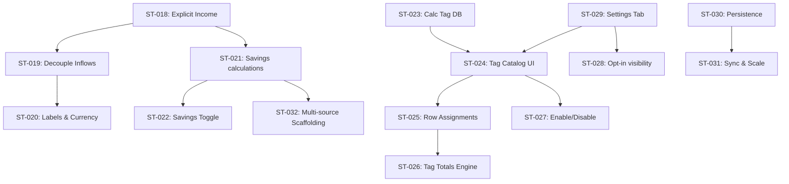

# Epic: Budget-Aware Calculation Boxes — Income, Savings & Financial Tagging

> Product & Engineering Specification — myNotes
> Status: **Engineering Ready**
> Author: Antigravity (AI Architect) & Piyush (Staff Engineer)
> Last updated: 2026-06-19

---

## 1. Epic Overview

### 1.1 Current State (as built today)

| Area | Today |
| --- | --- |
| Block type | A `metrics` atom node embedded in a note via Tiptap; UI in `MetricsBlock.svelte`. |
| Rows | `{ id: string; checked: boolean; label: string }`. Numbers are parsed inline from `label`. |
| Derived figures | `income` = sum of positive row values, `expenses` = abs(sum of negatives), `net`/`sum` = total. These are **derived**, not user-defined. |
| Display toggles | Per-box node attrs: `showIncome`, `showExpenses`, `showMin`, `showMax`, `showMedian`, `excludeChecked`. |
| Savings | Does **not** exist. |
| Calc tags | Do **not** exist. The only tag system is the **note** tag system (`TagDatabase`, IndexedDB stores `tags` + `note_tags`), which is for note organization and must remain isolated from this feature. |
| Settings | Global Settings modal with tabs `sync · styling · editor`; preferences persist under `mynotes_*` localStorage keys. |

### 1.2 Vision

Turn the Calculation Box from a passive number-summing widget into a lightweight **personal budgeting surface**:

1. **Income becomes a first-class, user-defined value** (not auto-derived), architected for multiple income sources later.
2. **A dedicated, highly visible Savings block** answers "how much do I have left?" via `Savings = Income − Total`.
3. **A standalone, global Calculation Tag system** lets users categorize spend (Food, Rent, Travel, …) — completely separate from note tags.
4. **Opt-in per-tag totals** give aggregated insight without cluttering the default view.
5. **A clear settings architecture** separates global config (tag catalog), box-specific config (which summaries show here), and future user preferences.

### 1.3 Out of Scope (this epic)

- Multi-currency conversion / FX rates.
- Cross-note / cross-box budget reports and dashboards (designed for, not built).
- Recurring transactions, scheduled income, or forecasting.
- Bank/import integrations.
- Note-tag changes of any kind.

---

## 2. Product Goals

| # | Goal | Success signal |
| --- | --- | --- |
| G1 | Let users explicitly declare income per Calculation Box. | Users set income on ≥1 box without confusion; no regression for existing boxes. |
| G2 | Make remaining money instantly visible. | Savings figure visible & correct; updates live as rows/income change. |
| G3 | Provide a standalone financial categorization system. | Users create/assign calc tags; note tags remain untouched. |
| G4 | Keep the default view clean. | Tag totals & savings are opt-in / sensibly defaulted; no clutter complaints. |
| G5 | Build for scale & future budgeting/reporting. | Global tag store handles many boxes; data model supports multi-source income & reports without migration pain. |

### Non-Goals / Guardrails
- **No coupling to note tags.** Separate store, separate IDs, separate UI.
- **No breaking changes** to existing boxes — every new capability is additive and defaulted off or to legacy behavior.
- **Local-first.** Must work offline and round-trip through the existing note HTML + IndexedDB persistence and Google Drive sync.

---

## 3. Information Architecture

### 3.1 Where each setting lives

| Setting | Scope | Home | Persistence |
| --- | --- | --- | --- |
| Tag catalog (the tags themselves) | **Global** | Settings → Calculation → Tag Catalog | IndexedDB (new `calc_tags` store) |
| Tag enabled/disabled | **Global** | Settings → Calculation | IndexedDB `calc_tags` store |
| Tag color | **Global** | Settings → Calculation | IndexedDB `calc_tags` store |
| Which tag totals are visible | **Global default + per-box override** | Global default in Settings; override on the box | Default: localStorage `mynotes_*`; override: node attr |
| Income value | **Per-box** | On the box | Node attr (`income` / `incomeSources`) |
| Income label / currency symbol | **Global default, per-box override** | Settings default; box override | localStorage default + node attr |
| Show/hide Savings | **Per-box** (global default) | On the box | Node attr (`showSavings`) |
| Tag assignment on a row | **Per-row (per-box)** | Inline on row | Inside `data` rows JSON |

### 3.2 System boundaries (critical)

```
        NOTE ORGANIZATION                 FINANCIAL CATEGORIZATION
   ┌──────────────────────────┐      ┌──────────────────────────────┐
   │ TagDatabase (existing)   │      │ CalcTagStore (NEW)           │
   │  DB: myNotesMetadata_<v> │      │  DB: myNotesMetadata_<v>     │
   │  stores: tags, note_tags │  ✗   │  store: calc_tags (NEW)      │
   │  used by: note sidebar   │ ──── │  used by: Calculation Boxes  │
   └──────────────────────────┘ no   └──────────────────────────────┘
                                link
```
**Hard rule:** no shared IDs, no shared store, no shared UI, no read/write across the boundary.

---

## 4. Epic Decomposition (Story-by-Story Track)

Here is the step-by-step decomposition of the Budget-Aware Calculation Boxes epic, sequentially numbered starting from `ST-018`.



---

### ST-018: Add an explicit Income field to a Calculation Box
- **Description**: Add an `income` node attribute (number, default `0`) to the `metrics` node. Render a single, editable Income input at the top of the box. Supports validation and formatting.
- **User Value**: I can state my income directly instead of relying on auto-derivation from positive lines.
- **Scope**:
  - Add `income` (default `0`) attribute to `metrics` TiptapNode in `Editor.svelte`.
  - Add a styled, editable income row in `MetricsBlock.svelte` right below the block title.
- **Acceptance Criteria**:
  - [ ] New `income` attribute exists on the `metrics` node, default `0`, correctly parsed/serialized in `parseHTML`/`renderHTML`.
  - [ ] An Income numeric input is visible at the top of the box; editing and blurring persists the value via `updateAttributes({ income: value })`.
  - [ ] Empty or invalid input (e.g., typing text) coerces to `0` on blur. Negative income is allowed but flagged with a subtle warning border/icon.
  - [ ] Existing boxes with no `income` attribute load with `income = 0` and function exactly as before.
- **Complexity**: S
- **Dependencies**: None.

### ST-019: Decouple income display from auto-derived "income"
- **Description**: Update the stats calculation loop to separate user-defined `income` from the auto-derived positive rows. Relabel the positive rows so there is no confusion.
- **User Value**: The box shows the budget/income I declared, not a number guessed from positive rows.
- **Scope**:
  - Modify stats computation inside `MetricsBlock.svelte` to treat the node attribute `income` as the authoritative source of "Income".
  - Rename the positive rows category from "Income" to "Inflows" or "Credits" in both the settings dropdown options and the stats badge list.
- **Acceptance Criteria**:
  - [ ] The footer's "Income" badge reflects the user-entered value from `ST-018`.
  - [ ] Legacy positive row totals are grouped under "Inflows" or "Credits" instead of "Income".
  - [ ] The `showIncome` toggle now governs the user-defined Income display, not the positive row sum.
  - [ ] No regressions in `expenses`, `net`, or `sum` computations.
- **Complexity**: S
- **Dependencies**: ST-018.

### ST-020: Income labeling & currency symbol overrides
- **Description**: Support an optional `incomeLabel` (string, default "Income") and a currency symbol with a per-box override.
- **User Value**: My income reads naturally according to my locale and paycheck type (e.g. "Salary", "₹").
- **Scope**:
  - Add `incomeLabel` attribute (default "Income") to the `metrics` node.
  - Render the label next to the income input.
  - Fall back to the global currency symbol (default "₹") defined in Settings (`ST-029`).
- **Acceptance Criteria**:
  - [ ] Income row displays the dynamic label (default "Income") and currency symbol.
  - [ ] Editing the label on the box persists it as a node attribute.
  - [ ] Falls back to "₹" when no global settings exist.
- **Complexity**: S
- **Dependencies**: ST-018, ST-019.

### ST-021: Savings block (hero) with `Savings = Income + Net Total`
- **Description**: Compute savings as the sum of declared income and the net row values (where expenses are negative, and credits are positive). Render a prominent, color-coded Savings panel.
- **User Value**: I instantly see how much money I have left.
- **Scope**:
  - Compute `savings = income + stats.net` reactively on any row value, income, or check state changes.
  - Add a styled Savings panel to the bottom of the Metrics block.
- **Acceptance Criteria**:
  - [ ] Savings = Income + Net Total computed reactively (`$derived`) on any row, check state, or income change.
  - [ ] Positive savings are styled with green (safe), zero is neutral, and negative savings are styled with red (overspent).
  - [ ] Respects `excludeChecked` consistently with row total computations.
  - [ ] Correctly calculates when there are zero rows (Savings = Income).
- **Complexity**: M
- **Dependencies**: ST-018, ST-019.

### ST-022: Per-box Savings visibility toggle (`showSavings`)
- **Description**: Introduce a `showSavings` node attribute (boolean) and toggle inside the box's settings popover to show/hide the Savings hero panel.
- **User Value**: I can hide Savings on boxes where it's irrelevant.
- **Scope**:
  - Add `showSavings` attribute to `metrics` node schema.
  - Add a checkbox toggle for "Savings" in the Metrics settings dropdown menu.
- **Acceptance Criteria**:
  - [ ] `showSavings` defaults to true if income > 0, false otherwise.
  - [ ] Toggling the checkbox persists the visibility state per box.
  - [ ] Legacy calculation boxes default safely to hidden.
- **Complexity**: S
- **Dependencies**: ST-021.

### ST-023: Calculation Tag data layer (standalone store)
- **Description**: Create a dedicated IndexedDB object store `calc_tags` in the metadata database, completely separate from the note tag system.
- **User Value (Enabler)**: A reliable, isolated home for budget categorization tags.
- **Scope**:
  - Create `CalcTagStore` (e.g. `src/lib/storage/CalcTagSchema.ts`) managing the `calc_tags` store.
  - Implement basic CRUD database methods.
- **Acceptance Criteria**:
  - [ ] `CalcTag { id, name, normalizedName, color?, enabled: boolean, createdAt }` interface defined.
  - [ ] DB version incremented cleanly with `calc_tags` store initialization on upgrade.
  - [ ] Uniqueness enforced case-insensitively on `normalizedName`.
  - [ ] CRUD API functions: `addCalcTag`, `listCalcTags`, `updateCalcTag`, `deleteCalcTag`, `setTagEnabled`.
  - [ ] Zero references or import statements to note tags.
- **Complexity**: M
- **Dependencies**: Coordinate DB upgrade with existing IndexedDB instances.

### ST-024: Global Tag Catalog UI (Settings integration)
- **Description**: Add the Tag Catalog manager UI under the Calculation settings tab, supporting creation, renaming, recoloring, and deletion.
- **User Value**: I manage all my budget categories in one place.
- **Scope**:
  - Render tag catalog list inside Settings Calculation tab (`ST-029`).
  - Add inline fields to edit names, pick colors from a palette, and delete tags.
- **Acceptance Criteria**:
  - [ ] Creation field validates against non-empty, unique (case-insensitive) tag names.
  - [ ] Renaming updates `name` and `normalizedName` globally in the database.
  - [ ] Deleting a tag prompts with a warning explaining that existing assignments will be cleared.
  - [ ] Explanatory text clearly states: "These tags are separate from Note Tags."
- **Complexity**: M
- **Dependencies**: ST-023, ST-029.

### ST-025: Assign a tag to a calculation row
- **Description**: Extend row schema with an optional `tagId` and render a tag picker next to each row input inside the block.
- **User Value**: I can categorize each line item (e.g., Food, Travel).
- **Scope**:
  - Update row interface: `{ id: string; checked: boolean; label: string; tagId?: string }`.
  - Add an inline tag dropdown picker to the left of the delete button on hover/focus.
- **Acceptance Criteria**:
  - [ ] Row schema supports `tagId`. Pickup dropdown shows active enabled tags + "None".
  - [ ] Selecting/changing a tag updates and persists the row list via `saveRows()`.
  - [ ] Renders a compact color-coded tag indicator pill next to the row description.
  - [ ] Gracefully treats missing/orphaned `tagId`s (e.g., deleted tags) as "Untagged".
- **Complexity**: M
- **Dependencies**: ST-023, ST-024.

### ST-026: Compute per-tag totals (engine)
- **Description**: Compute a reactive map of `tagId -> total` for the box, respecting row values and `excludeChecked`.
- **User Value (Enabler)**: Prepares category-level spending reports.
- **Scope**:
  - Add derived calculations inside `MetricsBlock.svelte` to aggregate row totals grouped by `tagId`.
- **Acceptance Criteria**:
  - [ ] A `$derived` map aggregates total amounts by tag.
  - [ ] Excluded/checked rows are correctly omitted if `excludeChecked` is active.
  - [ ] Untagged rows are aggregated in a distinct "Untagged" total bucket.
- **Complexity**: S
- **Dependencies**: ST-025.

### ST-027: Enable / disable tags globally
- **Description**: Support disabling tags so they don't appear in dropdown selectors but preserve historic row assignments.
- **User Value**: I can retire a category without deleting its past history.
- **Scope**:
  - Wire the `enabled` checkbox toggle in the Settings Tag Catalog to the database.
  - Filter out disabled tags from row-tag select pickers.
- **Acceptance Criteria**:
  - [ ] Toggling a tag's `enabled` state is persisted globally.
  - [ ] Disabled tags are hidden from dropdown selection menus.
  - [ ] Existing rows assigned to a disabled tag continue to show the tag label (styled muted/disabled).
- **Complexity**: S
- **Dependencies**: ST-023, ST-024, ST-025.

### ST-028: Choose which tag totals are visible (opt-in summaries)
- **Description**: Render selected tag totals beneath the box rows, with a global default settings configuration and per-box overrides.
- **User Value**: I see only the category summaries I care about.
- **Scope**:
  - Add `visibleTagTotals` node attribute (array of string tag IDs) to `metrics` node.
  - Render a row of compact category summary chips below the main list.
- **Acceptance Criteria**:
  - [ ] By default, no category totals are displayed.
  - [ ] User can check/select tags in the block settings dropdown to display their totals.
  - [ ] Visible summaries update dynamically as row values change.
- **Complexity**: M
- **Dependencies**: ST-026, ST-027, ST-029.

### ST-029: Calculation Box Settings tab
- **Description**: Add a new "Calculation" tab to the global Settings modal to manage the tag catalog and global display preferences.
- **User Value**: One unified settings page to configure my budget tags and styling options.
- **Scope**:
  - Create the UI layout for the tab in `AppLayout.svelte`.
  - Add settings for default currency symbol, default income label, and tag catalog wrapper.
- **Acceptance Criteria**:
  - [ ] "Calculation" tab appears cleanly in the Settings modal sidebar.
  - [ ] Integrates the Tag Catalog UI (`ST-024`) and persists global preferences to `localStorage` under `mynotes_calc_*` keys.
- **Complexity**: M
- **Dependencies**: None.

### ST-030: Persistence & note HTML round-trip
- **Description**: Ensure all new metrics attributes and row schema properties survive note saving, file reloads, and HTML serialization.
- **User Value**: My budgets and row category selections are safely saved and load correctly next time.
- **Scope**:
  - Update `Editor.svelte` TiptapNode methods `parseHTML` and `renderHTML` to serialize all new attributes (`income`, `incomeLabel`, `showSavings`, `visibleTagTotals`) and row `tagId`s into note HTML nodes.
- **Acceptance Criteria**:
  - [ ] Modifying, closing, and reopening a note preserves the declared income and row tag assignments.
  - [ ] Legacy note HTML loads without console warnings or layout breakage (graceful degradation).
- **Complexity**: M
- **Dependencies**: ST-018, ST-022, ST-025, ST-028.

### ST-031: Sync & multi-note scalability
- **Description**: Confirm that global tag stores and local note attributes sync correctly via Google Drive and don't lag on large vaults.
- **User Value**: My budget categories sync correctly across my mobile and desktop devices.
- **Scope**:
  - Ensure the IndexedDB metadata store (`calc_tags`) is synchronized.
  - Check performance with multiple notes containing metrics blocks.
- **Acceptance Criteria**:
  - [ ] Editing note content on one device updates metrics correctly on sync without corrupting global tag identifiers.
  - [ ] O(rows) execution limits in Svelte reactive loops prevent typing lag.
- **Complexity**: M
- **Dependencies**: ST-023, ST-030.

### ST-032: Multi-source income data model scaffolding
- **Description**: Scaffold the data model to support `incomeSources?: Array<{ id; label; amount }>` for future multi-source calculations, while presenting a simple single-income field.
- **User Value**: Prepares the codebase for tracking multiple cash streams in a future release.
- **Scope**:
  - Update the metrics schema to support the `incomeSources` array.
  - Ensure `Savings` calculates from the sum of sources if the array is present.
- **Acceptance Criteria**:
  - [ ] Schema is ready for multi-source data structures.
  - [ ] Savings calculates correctly from multiple sources when parsed.
- **Complexity**: S
- **Dependencies**: ST-018, ST-021.

### ST-033: Bug - Income changes do not update Remaining Budget reactively
- **Description**: Svelte 5 `$derived` doesn't automatically propagate changes deeply through custom NodeViews when parent `blockState.node` is reassigned to non-reactive ProseMirror nodes. Fix this by declaring local `$state` variables in `MetricsBlock.svelte` and synchronizing them in a unified `$effect`.
- **User Value**: Remaining budget (Savings) updates live as soon as I modify the Income field.
- **Acceptance Criteria**:
  - [ ] Modifying and blurring the Income field updates the Savings hero card immediately without a page refresh.
- **Complexity**: S
- **Dependencies**: ST-018, ST-021.

### ST-034: Bug - Settings dropdown menu triggers and closes instantly
- **Description**: Svelte 5's delegated event listener model causes `showSettings` to trigger a click listener on `window` in the same event loop cycle. Fix this by executing window listener registration inside a `setTimeout(..., 0)` block and checking the target element using `.closest()`.
- **User Value**: Clicking the block settings gear button toggles the dropdown settings options menu reliably.
- **Acceptance Criteria**:
  - [ ] Clicking the gear button toggles the menu open. Clicking outside closes it.
- **Complexity**: S
- **Dependencies**: None.

---

## 5. Implementation Roadmap & Roadmap Phases

### Phase 1: Budget Foundations (ST-018, ST-019, ST-021, ST-022)
- **Why**: Deliver immediate, high-value visual enhancements: letting users set explicit incomes and see a calculated savings figure.
- **Outcome**: Users can declare a budget and see live savings totals.

### Phase 2: Category Infrastructure & Store (ST-023, ST-029, ST-024)
- **Why**: Build the database schema and Settings controls needed for tag categorization.
- **Outcome**: A functional Settings tab containing a Tag Catalog editor.

### Phase 3: Row Tagging & Calculations (ST-025, ST-026, ST-027, ST-028)
- **Why**: Connect tags to row items and build the reactive aggregation logic.
- **Outcome**: Users can tag list lines and view summary totals per category.

### Phase 4: Integration & Hardening (ST-020, ST-030, ST-031, ST-032)
- **Why**: Finalize localization styling, ensure file persistence round-tripping, and test sync integrity.
- **Outcome**: Production-ready, fully synchronized budget-aware calculation boxes.
