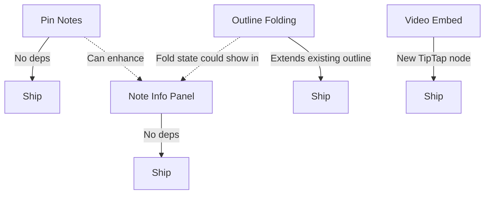

# Editor Features Epic — Full Implementation Plan

> **Version**: 1.0  
> **Date**: 2026-06-30  
> **Status**: Planning  
> **Scope**: 4 major features — Video Embed, Outline Folding, Pin Notes, Note Info Panel

---

## Table of Contents

1. [Feature 1: Embed YouTube/Vimeo (Video Embed Block)](#feature-1-embed-youtubevimeo-video-embed-block)
2. [Feature 2: Outline & Folding by Headings](#feature-2-outline--folding-by-headings)
3. [Feature 3: Pin Notes to Top (Per-Notebook)](#feature-3-pin-notes-to-top-per-notebook)
4. [Feature 4: Note Info Panel](#feature-4-note-info-panel)
5. [Technical Architecture](#technical-architecture)
6. [Implementation Order & Dependencies](#implementation-order--dependencies)

---

---

## Feature 1: Embed YouTube/Vimeo (Video Embed Block)

### Overview

Allow users to paste a YouTube/Vimeo URL and have it automatically converted into an embedded video player inline within their note. This follows the same architectural pattern as the existing `PdfEmbed`, `FileAttachment`, and `Diagram` custom TipTap nodes.

---

### User Stories

| ID | Story | Acceptance Criteria | Priority |
|----|-------|-------------------|----------|
| VE-001 | As a user, I want to paste a YouTube URL and see an embedded video player | Pasting `https://youtube.com/watch?v=xxx` or `https://youtu.be/xxx` auto-converts to embed | P0 |
| VE-002 | As a user, I want to paste a Vimeo URL and see an embedded video player | Pasting `https://vimeo.com/123456` auto-converts to embed | P0 |
| VE-003 | As a user, I want to resize the video player | Drag corners to resize, maintains 16:9 aspect ratio | P1 |
| VE-004 | As a user, I want to insert a video via the `.` slash menu | Typing `.video` or `.youtube` shows the insert option | P0 |
| VE-005 | As a user, I want to insert a video via the Insert (+) dropdown | The toolbar Insert dropdown includes "Video Embed" option | P1 |
| VE-006 | As a user, I want the video to render in read-only/view mode | Embedded iframes render and are playable in read mode | P0 |
| VE-007 | As a user, I want to delete a video embed | Select and press Backspace/Delete, or use node delete | P0 |
| VE-008 | As a user, I want generic URL embed support | Any iframe-embeddable URL (Google Maps, Figma, etc.) can be embedded | P2 |
| VE-009 | As a user, I want a fallback for unembeddable URLs | Shows a styled link card with title + favicon if embed fails | P2 |
| VE-010 | As a user, I want video embeds to not autoplay | Videos load paused, user must click play | P0 |

---

### Technical Design

#### 1. TipTap Custom Node: `VideoEmbed`

```typescript
// Extension: VideoEmbed
const VideoEmbed = TiptapNode.create({
  name: 'videoEmbed',
  group: 'block',
  atom: true,  // non-editable block
  
  addAttributes() {
    return {
      src: { default: null },           // embed URL (iframe src)
      originalUrl: { default: null },   // original pasted URL
      provider: { default: 'generic' }, // 'youtube' | 'vimeo' | 'generic'
      width: { default: '100%' },
      aspectRatio: { default: '16/9' },
    };
  },
  
  parseHTML() {
    return [
      { tag: 'div[data-type="videoEmbed"]' },
      { tag: 'iframe[data-video-embed]' },
    ];
  },
  
  renderHTML({ HTMLAttributes }) {
    return ['div', mergeAttributes(HTMLAttributes, { 
      'data-type': 'videoEmbed',
      class: 'video-embed-wrapper'
    }), ['iframe', { 
      src: HTMLAttributes.src,
      frameborder: '0',
      allowfullscreen: 'true',
      allow: 'accelerometer; autoplay; clipboard-write; encrypted-media; gyroscope; picture-in-picture',
      loading: 'lazy',
      'data-video-embed': 'true'
    }]];
  },

  addNodeView() {
    // Returns interactive wrapper with resize handles
  }
});
```

#### 2. URL Detection & Parsing

```typescript
// URL pattern matching
const VIDEO_PATTERNS = {
  youtube: [
    /(?:https?:\/\/)?(?:www\.)?youtube\.com\/watch\?v=([a-zA-Z0-9_-]{11})/,
    /(?:https?:\/\/)?youtu\.be\/([a-zA-Z0-9_-]{11})/,
    /(?:https?:\/\/)?(?:www\.)?youtube\.com\/embed\/([a-zA-Z0-9_-]{11})/,
    /(?:https?:\/\/)?(?:www\.)?youtube\.com\/shorts\/([a-zA-Z0-9_-]{11})/,
  ],
  vimeo: [
    /(?:https?:\/\/)?(?:www\.)?vimeo\.com\/(\d+)/,
    /(?:https?:\/\/)?player\.vimeo\.com\/video\/(\d+)/,
  ]
};

function parseVideoUrl(url: string): { provider: string; id: string; embedUrl: string } | null {
  for (const [provider, patterns] of Object.entries(VIDEO_PATTERNS)) {
    for (const pattern of patterns) {
      const match = url.match(pattern);
      if (match) {
        const id = match[1];
        const embedUrl = provider === 'youtube' 
          ? `https://www.youtube-nocookie.com/embed/${id}`
          : `https://player.vimeo.com/video/${id}`;
        return { provider, id, embedUrl };
      }
    }
  }
  return null;
}
```

#### 3. Paste Handler (Auto-Detect)

```typescript
// ProseMirror plugin to intercept paste events
const VideoEmbed_PastePlugin = new Plugin({
  key: new PluginKey('videoEmbedPaste'),
  props: {
    handlePaste(view, event) {
      const text = event.clipboardData?.getData('text/plain')?.trim();
      if (!text) return false;
      
      const video = parseVideoUrl(text);
      if (!video) return false;
      
      // Check if user is mid-sentence (don't embed if typing around text)
      const { $from } = view.state.selection;
      const isEmptyLine = $from.parent.content.size === 0;
      if (!isEmptyLine) return false;
      
      // Insert video embed node
      const node = view.state.schema.nodes.videoEmbed.create({
        src: video.embedUrl,
        originalUrl: text,
        provider: video.provider,
      });
      const tr = view.state.tr.replaceSelectionWith(node);
      view.dispatch(tr);
      return true;
    }
  }
});
```

#### 4. Security Considerations

- **CSP (Content Security Policy)**: Allow `frame-src` for `youtube-nocookie.com`, `player.vimeo.com`
- **Use youtube-nocookie.com** instead of youtube.com for privacy-enhanced mode
- **Sanitize URLs**: Only allow whitelisted domains for iframe src
- **No autoplay**: Embeds use `autoplay=0` parameter
- **Lazy loading**: Use `loading="lazy"` attribute on iframes
- **Sandbox attribute**: Apply `sandbox="allow-scripts allow-same-origin allow-presentation"` for security

#### 5. CSS Styling

```css
.video-embed-wrapper {
  position: relative;
  width: 100%;
  max-width: 720px;
  margin: 1em auto;
  border-radius: 12px;
  overflow: hidden;
  box-shadow: 0 4px 16px rgba(0, 0, 0, 0.2);
  border: 1px solid var(--border-color);
  transition: box-shadow 0.2s;
}

.video-embed-wrapper:hover {
  box-shadow: 0 6px 24px rgba(0, 0, 0, 0.3);
}

.video-embed-wrapper iframe {
  width: 100%;
  aspect-ratio: 16 / 9;
  border: none;
  display: block;
}

/* Provider badge */
.video-embed-wrapper::after {
  content: attr(data-provider);
  position: absolute;
  top: 8px;
  right: 8px;
  background: rgba(0, 0, 0, 0.6);
  color: white;
  font-size: 10px;
  padding: 2px 6px;
  border-radius: 4px;
  text-transform: capitalize;
  opacity: 0;
  transition: opacity 0.2s;
}

.video-embed-wrapper:hover::after {
  opacity: 1;
}

/* Resize handles */
.video-embed-wrapper .resize-handle {
  position: absolute;
  bottom: 0;
  right: 0;
  width: 16px;
  height: 16px;
  cursor: nwse-resize;
  opacity: 0;
  transition: opacity 0.2s;
}

.video-embed-wrapper:hover .resize-handle {
  opacity: 1;
}
```

---

### Slash Command Integration

Add to `getSlashCommands()` in Editor.svelte:

```typescript
{
  label: 'Video Embed',
  description: 'Embed a YouTube or Vimeo video',
  aliases: ['video', 'youtube', 'vimeo', 'embed', 'iframe', 'movie', 'clip'],
  icon: '<svg width="15" height="15" viewBox="0 0 24 24" fill="none" stroke="currentColor" stroke-width="2" stroke-linecap="round" stroke-linejoin="round"><polygon points="5 3 19 12 5 21 5 3"/></svg>',
  action: () => {
    // Show URL prompt
    appState.showPrompt({
      title: 'Embed Video',
      message: 'Paste a YouTube or Vimeo URL:',
      placeholder: 'https://youtube.com/watch?v=...',
      onConfirm: (url) => {
        const video = parseVideoUrl(url.trim());
        if (video) {
          editor?.chain().focus().insertContent({
            type: 'videoEmbed',
            attrs: { src: video.embedUrl, originalUrl: url, provider: video.provider }
          }).run();
        } else {
          appState.showToast('Invalid video URL. Supported: YouTube, Vimeo.', 'error');
        }
      }
    });
  },
  category: 'insert'
}
```

---

### Insert (+) Dropdown Integration

Add a "Video" button to the Insert dropdown in the formatting bar.

---

### Files to Modify

| File | Changes |
|------|---------|
| `src/lib/components/Editor.svelte` | Add VideoEmbed node definition, paste plugin, slash command, toolbar button, CSS |
| `index.html` | Update CSP meta tag if present |
| `public/sw.js` | No changes needed |

---

### Testing Checklist

- [ ] Paste YouTube standard URL → embeds correctly
- [ ] Paste YouTube short URL (youtu.be) → embeds correctly
- [ ] Paste YouTube Shorts URL → embeds correctly
- [ ] Paste Vimeo URL → embeds correctly
- [ ] Paste non-video URL → does NOT embed (stays as text)
- [ ] Paste video URL mid-sentence → stays as text (no embed)
- [ ] Video plays on click (no autoplay)
- [ ] Video renders in read-only mode
- [ ] Video renders after save/reload
- [ ] Delete video embed with Backspace
- [ ] Insert via `.video` slash command
- [ ] Insert via toolbar Insert dropdown
- [ ] Resize maintains 16:9 ratio
- [ ] Mobile responsive (full width, maintains ratio)
- [ ] Export to HTML includes working iframe

---

---

## Feature 2: Outline & Folding by Headings

### Overview

Enhance the existing outline/TOC panel to support **collapsible sections** — clicking a heading in the editor collapses all content beneath it until the next heading of equal or higher level. The outline panel also gets visual fold indicators.

**Existing Infrastructure** (already built):
- `showOutline` toggle state
- `OutlineHeading` interface with `{ level, text, pos }`
- `updateOutline()` function scanning heading nodes
- `.outline-panel` UI with click-to-scroll
- Level-based indentation CSS (`.outline-level-1` through `.outline-level-6`)

---

### User Stories

| ID | Story | Acceptance Criteria | Priority |
|----|-------|-------------------|----------|
| OF-001 | As a user, I want to click a fold icon next to a heading to collapse its content | Clicking ▶ next to H2 hides content until the next H2/H1 | P0 |
| OF-002 | As a user, I want the outline panel to show fold state | Collapsed headings show ▶, expanded show ▼ | P0 |
| OF-003 | As a user, I want to fold/unfold from the outline panel | Clicking fold icon in outline panel toggles the section | P1 |
| OF-004 | As a user, I want "Fold All" / "Unfold All" buttons | Quick buttons at top of outline panel | P1 |
| OF-005 | As a user, I want fold state to persist within the session | Folded sections stay folded until I unfold or close the note | P1 |
| OF-006 | As a user, I want a keyboard shortcut to fold/unfold | `Cmd+Shift+[` to fold, `Cmd+Shift+]` to unfold current section | P2 |
| OF-007 | As a user, I want to see nested structure in outline | Child headings are indented under parent headings | P0 (exists) |
| OF-008 | As a user, I want folded content to still be searchable | Cmd+F finds text inside folded sections (auto-unfolds) | P2 |
| OF-009 | As a user, I want visual indicator on folded headings | Small "..." or badge showing hidden content count | P2 |
| OF-010 | As a user, I want fold state to NOT affect the saved content | Folding is view-only, doesn't modify the HTML | P0 |

---

### Technical Design

#### 1. Data Model Extension

```typescript
interface OutlineHeading {
  level: number;       // 1-6
  text: string;        // heading text content
  pos: number;         // ProseMirror position
  id: string;          // unique identifier for tracking fold state
  collapsed: boolean;  // fold state
  childCount: number;  // number of child nodes (for badge)
}

// Fold state map (heading position → collapsed)
let foldState = $state<Map<string, boolean>>(new Map());
```

#### 2. Folding Mechanism (CSS-based, non-destructive)

The folding does NOT modify the document. Instead, it uses CSS classes and a ProseMirror decoration plugin to visually hide content:

```typescript
// ProseMirror Plugin: FoldingDecorations
const FoldingPlugin = new Plugin({
  key: new PluginKey('folding'),
  state: {
    init() { return { foldedRanges: [] }; },
    apply(tr, value) {
      // Recalculate folded ranges from foldState
      return { foldedRanges: computeFoldedRanges(tr.doc, foldState) };
    }
  },
  props: {
    decorations(state) {
      const { foldedRanges } = this.getState(state);
      const decorations = [];
      
      for (const range of foldedRanges) {
        // Add "collapsed" class to the heading node
        decorations.push(Decoration.node(range.headingFrom, range.headingTo, {
          class: 'heading-collapsed'
        }));
        
        // Hide content between this heading and the next same-level heading
        decorations.push(Decoration.node(range.contentFrom, range.contentTo, {
          class: 'folded-content',
          style: 'display: none;'
        }));
      }
      
      return DecorationSet.create(state.doc, decorations);
    }
  }
});
```

#### 3. Range Computation

```typescript
function computeFoldedRanges(doc: Node, foldState: Map<string, boolean>) {
  const ranges = [];
  const headings: Array<{ pos: number; level: number; id: string; endPos: number }> = [];
  
  // Collect all headings with positions
  doc.forEach((node, offset) => {
    if (node.type.name === 'heading') {
      headings.push({
        pos: offset,
        level: node.attrs.level,
        id: `h_${offset}_${node.textContent.slice(0, 20)}`,
        endPos: offset + node.nodeSize
      });
    }
  });
  
  // For each collapsed heading, find its content range
  for (let i = 0; i < headings.length; i++) {
    const h = headings[i];
    if (!foldState.get(h.id)) continue; // not collapsed
    
    // Find end: next heading of same or higher (lower number) level
    let endPos = doc.content.size; // default: end of doc
    for (let j = i + 1; j < headings.length; j++) {
      if (headings[j].level <= h.level) {
        endPos = headings[j].pos;
        break;
      }
    }
    
    ranges.push({
      headingFrom: h.pos,
      headingTo: h.endPos,
      contentFrom: h.endPos,
      contentTo: endPos
    });
  }
  
  return ranges;
}
```

#### 4. Fold Toggle UI (In-Editor)

```css
/* Fold indicator on headings */
:global(.tiptap h1),
:global(.tiptap h2),
:global(.tiptap h3),
:global(.tiptap h4) {
  position: relative;
  cursor: pointer;
}

:global(.tiptap h1::before),
:global(.tiptap h2::before),
:global(.tiptap h3::before),
:global(.tiptap h4::before) {
  content: '▼';
  position: absolute;
  left: -24px;
  top: 50%;
  transform: translateY(-50%);
  font-size: 10px;
  color: var(--text-tertiary);
  opacity: 0;
  transition: opacity 0.2s, transform 0.2s;
  cursor: pointer;
}

:global(.tiptap h1:hover::before),
:global(.tiptap h2:hover::before),
:global(.tiptap h3:hover::before),
:global(.tiptap h4:hover::before) {
  opacity: 1;
}

:global(.tiptap .heading-collapsed::before) {
  content: '▶' !important;
  opacity: 1 !important;
  color: var(--accent);
}

/* Folded content */
:global(.tiptap .folded-content) {
  display: none !important;
}

/* Collapsed indicator badge */
:global(.tiptap .heading-collapsed::after) {
  content: '···';
  margin-left: 8px;
  color: var(--text-tertiary);
  font-size: 0.7em;
  vertical-align: middle;
  background: var(--bg-surface);
  padding: 1px 6px;
  border-radius: 4px;
  border: 1px solid var(--border-color);
}
```

#### 5. Outline Panel Enhancement

```svelte
<!-- Enhanced Outline Panel -->
<div class="outline-panel">
  <div class="outline-header">
    <span>Outline</span>
    <div class="outline-actions">
      <button onclick={foldAll} title="Fold All">
        <ChevronsDownUp size={14} />
      </button>
      <button onclick={unfoldAll} title="Unfold All">
        <ChevronsUpDown size={14} />
      </button>
    </div>
  </div>
  
  {#each outlineHeadings as heading}
    <div class="outline-item outline-level-{heading.level}">
      <button 
        class="fold-toggle"
        onclick={() => toggleFold(heading.id)}
      >
        {heading.collapsed ? '▶' : '▼'}
      </button>
      <span 
        class="outline-text"
        class:collapsed={heading.collapsed}
        onclick={() => scrollToHeading(heading.pos)}
      >
        {heading.text}
      </span>
    </div>
  {/each}
</div>
```

---

### Files to Modify

| File | Changes |
|------|---------|
| `src/lib/components/Editor.svelte` | Extend OutlineHeading, add FoldingPlugin, fold toggle click handler, CSS, keyboard shortcuts |

---

### Testing Checklist

- [ ] Click fold icon on H2 → content below collapses until next H2/H1
- [ ] Click again → content unfolds
- [ ] Nested: H3 under H2 folds only its own content
- [ ] Fold All button collapses everything
- [ ] Unfold All button expands everything
- [ ] Folded state persists while editing (doesn't reset on typing)
- [ ] Content inside folds is NOT deleted from document
- [ ] Save/reload → fold state resets (session-only)
- [ ] Outline panel shows fold indicators
- [ ] Click outline item → scrolls to heading (even if folded parent)
- [ ] Cmd+F search inside folded content auto-unfolds
- [ ] Mobile: fold icons accessible via tap

---

---

## Feature 3: Pin Notes to Top (Per-Notebook)

### Overview

Allow users to pin notes to the top of the note list. Pinned notes appear in a visually distinct "Pinned" section above all other notes, regardless of sort order. Pinning is per-notebook context — a note pinned while viewing "Work" notebook shows pinned only there.

**Existing Infrastructure** (already built):
- `pinned: boolean` field in `parseHtmlMetadata()` 
- `pinned` field in `generateHtmlNote()`
- HTML storage: `<meta name="pinned" content="true">`
- Already parsed from both HTML meta tags and frontmatter

---

### User Stories

| ID | Story | Acceptance Criteria | Priority |
|----|-------|-------------------|----------|
| PN-001 | As a user, I want to pin a note so it stays at the top of the list | Right-click or menu → "Pin Note" moves it above unpinned notes | P0 |
| PN-002 | As a user, I want to unpin a note | Same action toggles pin off | P0 |
| PN-003 | As a user, I want a visual indicator for pinned notes | Pin icon (📌) or badge on the note card | P0 |
| PN-004 | As a user, I want a "Pinned" section header in the note list | Divider between pinned and unpinned notes | P1 |
| PN-005 | As a user, I want pinning to persist across sessions | Pin state saved in note metadata (already stored) | P0 |
| PN-006 | As a user, I want to pin via swipe gesture (mobile) | Swipe right on note card → pin toggle | P2 |
| PN-007 | As a user, I want to pin from the note context menu | Right-click note → "Pin to Top" option | P0 |
| PN-008 | As a user, I want pinned notes sorted by their own modified date | Within the pinned group, most recent first | P1 |
| PN-009 | As a user, I want to bulk pin/unpin selected notes | In select mode, pin all selected notes at once | P2 |
| PN-010 | As a user, I want pin to work per-view | Pinned notes show pinned regardless of active notebook filter | P0 |

---

### Technical Design

#### 1. State Management

The `pinned` field already exists in metadata. We need to:
1. Expose a `togglePin(path: string)` method on appState
2. Sort pinned notes to top in `filteredNotes` getter
3. Add UI indicators

```typescript
// In appState.svelte.ts
togglePin(path: string) {
  const note = this.notes.find(n => n.path === path);
  if (!note) return;
  
  const parsed = parseHtmlMetadata(note.content);
  const newPinned = !parsed.meta.pinned;
  parsed.meta.pinned = newPinned;
  
  // Regenerate HTML with updated pinned state
  const updatedContent = generateHtmlNote(parsed.meta, parsed.body);
  note.content = updatedContent;
  
  // Save to storage
  this.storage.writeNote(path, updatedContent);
  
  // Update active note if it's the one being pinned
  if (this.activeNotePath === path) {
    this.activeNoteContent = updatedContent;
  }
  
  this.showToast(newPinned ? 'Note pinned' : 'Note unpinned', 'success', 2000);
}

// Check if a note is pinned
isNotePinned(path: string): boolean {
  const note = this.notes.find(n => n.path === path);
  if (!note) return false;
  return parseHtmlMetadata(note.content).meta.pinned === true;
}
```

#### 2. Sort Logic Enhancement

```typescript
// In filteredNotes getter, after all filtering, before returning:
get filteredNotes() {
  let list = /* ...existing filter logic... */;
  
  // Apply existing sort
  list = this.sortNotes(list);
  
  // Separate pinned and unpinned, pinned always on top
  const pinned = list.filter(n => parseHtmlMetadata(n.content).meta.pinned);
  const unpinned = list.filter(n => !parseHtmlMetadata(n.content).meta.pinned);
  
  // Sort pinned by modified date (newest first)
  pinned.sort((a, b) => {
    const aTime = new Date(parseHtmlMetadata(a.content).meta.modified || 0).getTime();
    const bTime = new Date(parseHtmlMetadata(b.content).meta.modified || 0).getTime();
    return bTime - aTime;
  });
  
  return [...pinned, ...unpinned];
}
```

#### 3. NoteList UI

```svelte
<!-- In NoteList.svelte, render with section divider -->
{#each displayNotes as note, index}
  {#if index === 0 && isNotePinned(note.path)}
    <div class="pinned-section-header">
      <Pin size={12} /> Pinned
    </div>
  {/if}
  
  {#if index > 0 && isNotePinned(displayNotes[index - 1].path) && !isNotePinned(note.path)}
    <div class="pinned-divider"></div>
  {/if}
  
  <div class="note-card" class:pinned={isNotePinned(note.path)}>
    {#if isNotePinned(note.path)}
      <Pin size={10} class="pin-indicator" />
    {/if}
    <!-- ...existing note card content... -->
  </div>
{/each}
```

#### 4. Context Menu Integration

Add "Pin to Top" / "Unpin" option to the existing right-click context menu on note cards.

#### 5. CSS

```css
.pinned-section-header {
  display: flex;
  align-items: center;
  gap: 6px;
  padding: 8px 12px 4px;
  font-size: var(--font-size-xs);
  font-weight: 700;
  color: var(--text-tertiary);
  text-transform: uppercase;
  letter-spacing: 0.5px;
}

.pinned-divider {
  height: 1px;
  background: var(--border-color);
  margin: 8px 12px;
}

.note-card.pinned {
  border-left: 2px solid var(--accent);
}

.pin-indicator {
  color: var(--accent);
  flex-shrink: 0;
}
```

---

### Performance Consideration

Calling `parseHtmlMetadata()` for every note on every render for pin checking is expensive. **Optimization**: Cache pinned state in a reactive `Set<string>` that updates only when notes change:

```typescript
// Cached pinned paths
pinnedPaths = $derived(new Set(
  this.notes
    .filter(n => parseHtmlMetadata(n.content).meta.pinned)
    .map(n => n.path)
));
```

---

### Files to Modify

| File | Changes |
|------|---------|
| `src/lib/stores/appState.svelte.ts` | Add `togglePin()`, `pinnedPaths` derived, modify `filteredNotes` sort |
| `src/lib/components/NoteList.svelte` | Add pin indicator, section header, context menu option |
| `src/lib/components/AppLayout.svelte` | Add pin option to mobile note context menu |

---

### Testing Checklist

- [ ] Right-click note → "Pin to Top" → note moves to top
- [ ] Pinned note shows pin icon
- [ ] "Pinned" section header appears above pinned notes
- [ ] Divider appears between pinned and unpinned
- [ ] Unpin → note returns to normal sort position
- [ ] Pin persists after page reload
- [ ] Pin works when filtering by notebook (pinned notes in that notebook show at top)
- [ ] Pin works when filtering by tag
- [ ] Multiple pinned notes sorted by modified date within pinned section
- [ ] Bulk select + pin works
- [ ] Mobile: pin via context menu works
- [ ] Performance: no lag with 100+ notes

---

---

## Feature 4: Note Info Panel

### Overview

A toggleable info panel/drawer that displays comprehensive metadata about the currently open note — created date, modified date, word count, character count, reading time, paragraph count, and note path. Accessible via a toolbar button or keyboard shortcut.

---

### User Stories

| ID | Story | Acceptance Criteria | Priority |
|----|-------|-------------------|----------|
| NI-001 | As a user, I want to see the word count of my note | Displays total word count, updates live | P0 |
| NI-002 | As a user, I want to see character count | With and without spaces | P0 |
| NI-003 | As a user, I want to see created date | Shows when the note was first created | P0 |
| NI-004 | As a user, I want to see last modified date | Shows when the note was last saved | P0 |
| NI-005 | As a user, I want to see estimated reading time | Based on 200 WPM average | P1 |
| NI-006 | As a user, I want to see paragraph count | Number of paragraph blocks | P2 |
| NI-007 | As a user, I want to see heading count | Number of headings in the note | P2 |
| NI-008 | As a user, I want to see the note's file path/location | Which notebook it belongs to | P1 |
| NI-009 | As a user, I want to see the note's tags | List of tags with click-to-filter | P1 |
| NI-010 | As a user, I want to toggle the panel via toolbar button | ℹ️ button in editor toolbar opens/closes panel | P0 |
| NI-011 | As a user, I want the panel to not obstruct editing | Shows as a small footer bar or slide-out drawer | P0 |
| NI-012 | As a user, I want to see selection stats when text is selected | Selected words/chars shown alongside total | P1 |
| NI-013 | As a user, I want to copy note info | Click to copy any stat value | P2 |
| NI-014 | As a user, I want a keyboard shortcut | `Cmd+Shift+I` toggles the info panel | P1 |

---

### Technical Design

#### 1. Statistics Computation

```typescript
// Reactive computed stats from editor content
let noteStats = $derived.by(() => {
  if (!editor) return null;
  
  const text = editor.getText();
  const words = text.trim() ? text.trim().split(/\s+/).length : 0;
  const characters = text.length;
  const charactersNoSpaces = text.replace(/\s/g, '').length;
  const paragraphs = editor.state.doc.content.content.filter(
    n => n.type.name === 'paragraph' && n.textContent.trim().length > 0
  ).length;
  const headings = editor.state.doc.content.content.filter(
    n => n.type.name === 'heading'
  ).length;
  const readingTime = Math.max(1, Math.ceil(words / 200)); // minutes
  
  return { words, characters, charactersNoSpaces, paragraphs, headings, readingTime };
});

// Selection stats
let selectionStats = $derived.by(() => {
  if (!editor || editor.state.selection.empty) return null;
  
  const { from, to } = editor.state.selection;
  const selectedText = editor.state.doc.textBetween(from, to, ' ');
  const words = selectedText.trim() ? selectedText.trim().split(/\s+/).length : 0;
  const characters = selectedText.length;
  
  return { words, characters };
});
```

#### 2. Metadata Retrieval

```typescript
// Get note metadata
let noteMeta = $derived.by(() => {
  if (!$activeNotePath) return null;
  const note = appState.notes.find(n => n.path === $activeNotePath);
  if (!note) return null;
  
  const parsed = parseHtmlMetadata(note.content);
  return {
    created: parsed.meta.created,
    modified: parsed.meta.modified,
    tags: parsed.meta.tags || [],
    path: $activeNotePath,
    notebook: $activeNotePath.includes('/') ? $activeNotePath.split('/')[0] : null,
  };
});
```

#### 3. UI Design — Compact Footer Bar

The info panel displays as a slim bar at the bottom of the editor (above the mobile toolbar on mobile):

```svelte
{#if showNoteInfo && noteStats && noteMeta}
  <div class="note-info-bar" transition:slide={{ duration: 200 }}>
    <div class="info-stats">
      <span class="info-stat" title="Words">
        <Type size={11} /> {noteStats.words}{selectionStats ? ` (${selectionStats.words} selected)` : ''}
      </span>
      <span class="info-divider">·</span>
      <span class="info-stat" title="Characters">
        {noteStats.characters} chars
      </span>
      <span class="info-divider">·</span>
      <span class="info-stat" title="Reading time">
        ~{noteStats.readingTime} min read
      </span>
      <span class="info-divider">·</span>
      <span class="info-stat" title="Paragraphs">
        {noteStats.paragraphs} ¶
      </span>
    </div>
    
    <div class="info-meta">
      {#if noteMeta.notebook}
        <span class="info-stat notebook" title="Notebook">
          <Folder size={11} /> {noteMeta.notebook}
        </span>
        <span class="info-divider">·</span>
      {/if}
      <span class="info-stat" title="Created">
        Created {formatRelativeDate(noteMeta.created)}
      </span>
      <span class="info-divider">·</span>
      <span class="info-stat" title="Modified">
        Modified {formatRelativeDate(noteMeta.modified)}
      </span>
    </div>
  </div>
{/if}
```

#### 4. CSS

```css
.note-info-bar {
  display: flex;
  justify-content: space-between;
  align-items: center;
  padding: 4px 12px;
  background: var(--bg-surface);
  border-top: 1px solid var(--border-color);
  font-size: 11px;
  color: var(--text-tertiary);
  flex-shrink: 0;
  flex-wrap: wrap;
  gap: 4px 12px;
  min-height: 24px;
}

.info-stats, .info-meta {
  display: flex;
  align-items: center;
  gap: 6px;
  flex-wrap: wrap;
}

.info-stat {
  display: inline-flex;
  align-items: center;
  gap: 3px;
  white-space: nowrap;
}

.info-stat.notebook {
  color: var(--accent);
  font-weight: 600;
}

.info-divider {
  color: var(--border-color);
  user-select: none;
}

/* Hide on very small screens */
@media (max-width: 480px) {
  .info-meta {
    display: none;
  }
}
```

#### 5. Toolbar Toggle Button

Add an info button (ℹ️) to the editor toolbar:

```svelte
<button 
  class="icon-btn" 
  class:active={showNoteInfo}
  onclick={() => showNoteInfo = !showNoteInfo}
  title="Note Info (Cmd+Shift+I)"
>
  <Info size={16} />
</button>
```

#### 6. Keyboard Shortcut

```typescript
// In keyboard handler
if (event.metaKey && event.shiftKey && event.key === 'i') {
  event.preventDefault();
  showNoteInfo = !showNoteInfo;
}
```

#### 7. Relative Date Formatter

```typescript
function formatRelativeDate(dateStr: string | undefined): string {
  if (!dateStr) return 'Unknown';
  const date = new Date(dateStr);
  const now = new Date();
  const diffMs = now.getTime() - date.getTime();
  const diffMins = Math.floor(diffMs / 60000);
  const diffHours = Math.floor(diffMs / 3600000);
  const diffDays = Math.floor(diffMs / 86400000);
  
  if (diffMins < 1) return 'just now';
  if (diffMins < 60) return `${diffMins}m ago`;
  if (diffHours < 24) return `${diffHours}h ago`;
  if (diffDays < 7) return `${diffDays}d ago`;
  return date.toLocaleDateString('en-US', { month: 'short', day: 'numeric', year: date.getFullYear() !== now.getFullYear() ? 'numeric' : undefined });
}
```

---

### Files to Modify

| File | Changes |
|------|---------|
| `src/lib/components/Editor.svelte` | Add `showNoteInfo` state, stats computation, info bar HTML, CSS, keyboard shortcut, toolbar button |

---

### Testing Checklist

- [ ] Toggle info bar via toolbar button
- [ ] Toggle via `Cmd+Shift+I`
- [ ] Word count updates as user types
- [ ] Character count (with and without spaces) correct
- [ ] Reading time calculation (words / 200, minimum 1 min)
- [ ] Created date displays correctly
- [ ] Modified date updates after save
- [ ] Notebook name shows when note is in a folder
- [ ] Selection: shows selected word/char count
- [ ] Selection: clears when deselected
- [ ] Empty note: shows "0 words, 0 chars"
- [ ] Panel doesn't push editor content (slim bar)
- [ ] Mobile: stat bar shows (meta hidden on small screens)
- [ ] Persists toggle state in localStorage

---

---

## Technical Architecture

### Shared Patterns

All 4 features follow established patterns in the codebase:

| Pattern | Used By | Applied To |
|---------|---------|-----------|
| Custom TipTap Node | PdfEmbed, Diagram, Metrics | Video Embed |
| ProseMirror Plugin | CollapsibleKeymap, FocusMode | Folding Plugin |
| Metadata in HTML `<meta>` | created, modified, tags | Pin state (already exists) |
| Toolbar toggle button | Outline, Source Mode | Note Info panel |
| Slash command entry | All insert commands | Video Embed |
| `$derived` reactive computation | filteredNotes, sortedTags | Note stats, pin sorting |
| localStorage persistence | sidebar state, theme | Info panel toggle, (fold state session-only) |

### Security

| Feature | Security Concern | Mitigation |
|---------|-----------------|------------|
| Video Embed | XSS via iframe | Whitelist domains (youtube-nocookie.com, player.vimeo.com) |
| Video Embed | Data exfiltration | sandbox attribute, no allow-top-navigation |
| Video Embed | Malicious URLs | Validate URL format before embedding |
| Folding | Content loss | Folding is CSS-only, document unchanged |
| Pin | Data integrity | Uses existing metadata system |
| Note Info | Privacy | All computation local, no external calls |

### Performance

| Feature | Concern | Mitigation |
|---------|---------|-----------|
| Video Embed | Heavy iframes | `loading="lazy"`, only loads when visible |
| Folding | Decoration recalc | Only recalc on fold state change, debounce |
| Pin | parseHtmlMetadata on every note | Cache in `$derived` Set, recompute only when notes array changes |
| Note Info | Word count on every keystroke | Debounce 300ms, or compute from `editor.state.doc` change |

---

## Implementation Order & Dependencies

```
Phase 1 (Quick Wins — 1-2 days each):
├── Feature 3: Pin Notes          ← Infrastructure already exists, just needs UI + sort logic
└── Feature 4: Note Info Panel    ← Pure UI addition, no schema changes

Phase 2 (Medium — 2-3 days each):
├── Feature 2: Outline Folding   ← Builds on existing outline, needs ProseMirror plugin
└── Feature 1: Video Embed       ← New TipTap node + paste handler + security whitelist
```

### Dependency Graph



### Estimated Complexity

| Feature | Lines of Code (est.) | Risk | Notes |
|---------|---------------------|------|-------|
| Pin Notes | ~150 | Low | Metadata already stored; just UI + sort |
| Note Info Panel | ~200 | Low | Pure computation + UI |
| Outline Folding | ~350 | Medium | ProseMirror decorations can be tricky |
| Video Embed | ~400 | Medium | URL parsing + security + iframe lifecycle |

---

## Appendix: Whitelisted Video Domains

For the Video Embed feature, only these domains should be allowed in iframes:

| Domain | Service |
|--------|---------|
| `www.youtube-nocookie.com` | YouTube (privacy mode) |
| `www.youtube.com` | YouTube (standard) |
| `player.vimeo.com` | Vimeo |
| `www.dailymotion.com` | Dailymotion (future) |
| `www.loom.com` | Loom (future) |
| `www.figma.com` | Figma (future) |
| `docs.google.com` | Google Docs embeds (future) |
| `open.spotify.com` | Spotify (future) |

---

## Appendix: Keyboard Shortcuts Summary

| Feature | Shortcut | Action |
|---------|----------|--------|
| Note Info | `Cmd+Shift+I` | Toggle info panel |
| Fold Section | `Cmd+Shift+[` | Fold current heading section |
| Unfold Section | `Cmd+Shift+]` | Unfold current heading section |
| Fold All | `Cmd+Alt+[` | Fold all headings |
| Unfold All | `Cmd+Alt+]` | Unfold all headings |
| Pin Note | `Cmd+Shift+P` | Toggle pin on active note |

---

*End of Epic*
