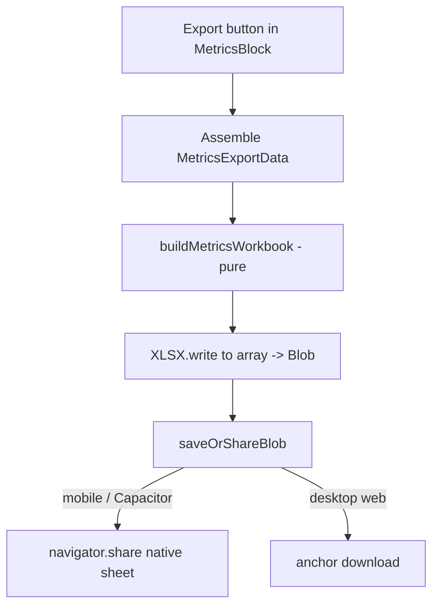
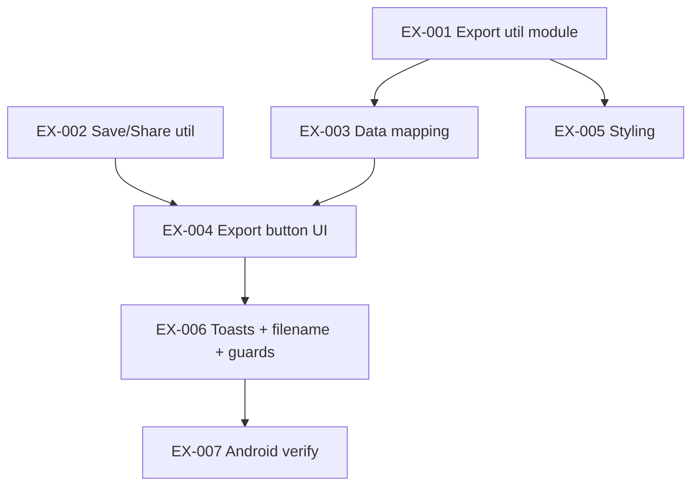
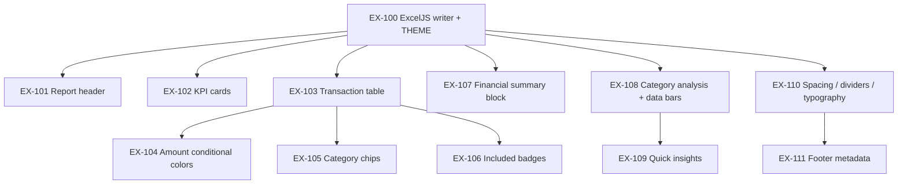

# Epic: Excel Export for Calculation Box

> Product & Engineering Specification — myNotes
> Status: **Part 1 (v1 Base Export) — ✅ SHIPPED** · **Part 2 (v2 Premium Workbook UI/UX) — 📋 Engineering Ready**
> Scope: v1 single-box styled `.xlsx` (done) → v2 professional, premium workbook design
> Last updated: 2026-07-05

---

> **📌 Implementation status — read first**
>
> **Part 1 (Sections 1–9) is COMPLETE and shipped.** The base single-box Excel export
> (button, data mapping, workbook builder, save/share, basic styling, Android) already works.
> **Do not re-implement Part 1.** It is documented below as the foundation you build on.
>
> **Part 2 (Section 10 onward) is the ACTIVE plan** — a premium UI/UX redesign of the
> exported workbook. That is what you implement.

---

## 1. Epic Overview

### 1.1 Goal

Let a user turn any Calculation Box (`MetricsBlock`) into a shareable, formatted
Excel spreadsheet in one tap — capturing the rows, the derived financial
summary, and per-category totals.

**User value:** _"I've built a budget/tally in a note — now I want it in Excel to
keep, share, or analyze further."_

### 1.2 Key decisions

| Decision | Choice |
| --- | --- |
| Export scope | **A single calculation box** (the one whose button is tapped). |
| Sheet contents | **Rows table + Summary block + Category totals.** |
| Format & styling | **Styled `.xlsx`** — bold headers, currency number format, tag-color fills. |
| Library | Reuse **`xlsx-js-style`** (already a dependency). No new packages. |
| Save/share | Reuse the app's existing **`navigator.share` → anchor-download** pattern (works on web + Android/Capacitor). |
| Availability | Export is **allowed in read-only notes** (it's read-only-safe). |
| Excluded rows | Shown in the rows table (flagged) but **excluded from summary/category math**, matching the on-screen figures. |

### 1.3 Out of scope (v1)

- Multi-box / whole-note export.
- CSV output.
- Respecting per-box `show*` display toggles (v1 always exports the full stat set).

---

## 2. Source Facts (verified against the codebase)

### 2.1 Component & data model

- **Component:** [`src/lib/components/MetricsBlock.svelte`](src/lib/components/MetricsBlock.svelte).
  Props: `{ nodeStore, getPos, editor, updateAttributes }`.
- **Rows** (local `$state`): `Array<{ id: string; checked: boolean; label: string; tagIds?: string[] }>`.
  Numbers are parsed from `label` via `getRowNumbers(label)`; a row's value = sum of its parsed numbers.
- **`activeRows`** — `rows` minus excluded rows when the `excludeChecked` attr is `true`.
- **`stats`** (derived, ~L652): `{ count, sum, average, min, max, median, income, inflows, expenses, net }`.
- **`savingsVal`** (derived, ~L706): `incomeVal + stats.net`.
- **`tagTotals`** (derived, ~L608): `{ totalsMap: Map<tagId, number>, untaggedTotal: number }`.
- **`currencyCode`** (~L526): per-box override, else `appState.defaultCurrency` (`'₹'`).
- **`incomeLabel`** (~L525) and **`title`** (~L598).

### 2.2 Calc tags

- `appState.calcTags: CalcTag[]`, where `CalcTag = { id, name, normalizedName, enabled, createdAt, color? }`
  (see [`src/lib/storage/CalcTagSchema.ts`](src/lib/storage/CalcTagSchema.ts)).
- Resolve a row's `tagIds` → `{ name, color }[]` for the export.

### 2.3 Spreadsheet library

- Imported as `import * as XLSX from 'xlsx-js-style'` (currently **read-only** usage in `Editor.svelte`).
- No export helper exists yet. Build with:
  `XLSX.utils.aoa_to_sheet`, `XLSX.utils.book_new`, `XLSX.utils.book_append_sheet`,
  `XLSX.write(wb, { bookType: 'xlsx', type: 'array' })` → `Blob`.
- Cell styling via `cell.s` (`font.bold`, `fill.fgColor.rgb`, `numFmt`).

### 2.4 Save / share pattern (reuse)

- `NotebookEditor.svelte` uses `navigator.share({ files: [File] })` when `navigator.canShare` is true
  ([~L1104](src/lib/components/NotebookEditor.svelte#L1104)), falling back to an anchor download
  (`downloadBlob`, [~L1280](src/lib/components/NotebookEditor.svelte#L1280)).
- On Android/Capacitor, `navigator.share` opens the native share sheet (save to Files/Drive).
- Platform check: `(window as any).Capacitor?.isNativePlatform?.()`.

### 2.5 UI anchor & toasts

- Header template: `.metrics-card-header` (~L988) = `BarChart3` icon + title input +
  `{#if !appState.isReadOnly}` settings gear (`settings-trigger-btn`, `toggleSettingsMenu`).
- lucide icons already imported from `'lucide-svelte'`.
- Toasts: `appState.showToast(msg, type, duration, undefined, loading)` and
  `appState.updateToast(id, { ... })`.

---

## 3. UI Design

- Add an **Export to Excel** icon button (lucide `Sheet`) in `.metrics-card-header` (~L988),
  placed **outside** the `{#if !appState.isReadOnly}` gear guard so it also works in read-only notes.
- Tooltip: `Export to Excel`.
- `onclick` → `handleExport()`:
  1. Assemble `MetricsExportData` from current derived state.
  2. Show a loading toast.
  3. `await exportMetricsToXlsx(data)`.
  4. Update toast to success, or error on failure.
- **Mobile:** the button triggers the native share sheet via `saveOrShareBlob`.

### Exported sheet layout ("Calculation")

```
┌───────────────────────────────────────────────┐
│  <Box Title>                                    │  ← title row (bold)
│                                                 │
│  Label        │ Value │ Category   │ Counted?   │  ← Rows header (bold fill)
│  Groceries    │  -206 │ Food       │ Yes        │  ← Category cell filled w/ tag color
│  Salary       │ 50000 │ —          │ Yes        │
│  ...                                            │
│                                                 │
│  Summary                                        │  ← section header (bold)
│  Income       │ 50000                           │
│  Inflows      │ ...                             │
│  Expenses     │ ...                             │
│  Net          │ ...                             │
│  Savings      │ ...                             │
│  Count / Average / Min / Max / Median           │
│                                                 │
│  Category Totals                                │  ← section header (bold)
│  Food         │ -206     (cell filled w/ color) │
│  Travel       │ ...                             │
│  Untagged     │ ...                             │
└───────────────────────────────────────────────┘
```

- Value/summary numeric cells use a currency `numFmt` built from `currencyCode`:
  `'"' + currencyCode + '"#,##0.00'`.
- Column widths set via `ws['!cols']`.

---

## 4. Technology & Architecture

- **No new dependencies** — reuse `xlsx-js-style`.
- **Separation of concerns:**
  - Pure workbook builder + export orchestrator in a util module (testable without the DOM).
  - Reusable save/share helper shared across the app.
  - `MetricsBlock.svelte` only gathers data and renders the button.



---

## 5. Epic Decomposition (Stories) — ✅ v1 COMPLETE



### EX-001 — Workbook builder util — ✅ DONE
- **New file:** `src/lib/utils/exportMetricsXlsx.ts`.
- Define `MetricsExportData` type:
  ```ts
  interface MetricsExportRow { label: string; value: number; tags: { name: string; color?: string }[]; counted: boolean; }
  interface MetricsExportData {
    title: string;
    currency: string;
    incomeLabel: string;
    income: number;
    rows: MetricsExportRow[];
    stats: { count: number; sum: number; average: number; min: number; max: number; median: number; inflows: number; expenses: number; net: number; };
    savings: number;
    categoryTotals: { name: string; color?: string; total: number }[];
    untaggedTotal: number;
  }
  ```
- `buildMetricsWorkbook(data): XLSX.WorkBook` — **pure**, builds the single "Calculation" sheet with the three sections and `!cols`.
- `exportMetricsToXlsx(data): Promise<void>` — build → `XLSX.write(wb, { bookType:'xlsx', type:'array' })` → `Blob(type: 'application/vnd.openxmlformats-officedocument.spreadsheetml.sheet')` → `saveOrShareBlob`.
- **Acceptance:** given sample data, the workbook's cells (via `XLSX.utils.sheet_to_json`) contain correct rows, summary, and category totals.

### EX-002 — Save/Share util — ✅ DONE
- **New file:** `src/lib/utils/download.ts` exporting `saveOrShareBlob(blob, filename, mime)`.
- Try `navigator.share({ files: [new File([blob], filename, { type: mime })] })` when `navigator.canShare?.({ files:[...] })`; otherwise anchor-download (create object URL → click → revoke).
- **Optional:** refactor `NotebookEditor.svelte` to reuse this (limits blast radius — can be deferred).
- **Acceptance:** file saves on desktop; native share sheet appears on Android.

### EX-003 — Data mapping — ✅ DONE
- In `MetricsBlock.svelte`, assemble `MetricsExportData` from `rows`/`activeRows`, `stats`, `savingsVal`,
  `tagTotals`, `appState.calcTags`, `currencyCode`, `incomeLabel`, `title`.
- Rows table lists **all** rows; `counted = !(excludeChecked && row.checked)`.
- Summary/category values use the active set (match the on-screen numbers).
- Resolve `tagTotals.totalsMap` keys and row `tagIds` to tag `{ name, color }` via `appState.calcTags`.
- **Acceptance:** exported numbers equal what the box shows on screen.

### EX-004 — Export button UI — ✅ DONE
- Add lucide `Sheet` icon button in `.metrics-card-header` (~L988), outside the read-only guard.
- Wire `onclick` → `handleExport()`.
- **Acceptance:** button visible (including read-only); clicking exports.

### EX-005 — Styling — ✅ DONE
- Bold header rows with a subtle fill (e.g. `fgColor.rgb: 'E5E7EB'`).
- Currency `numFmt` from `currencyCode` on value/summary cells.
- Category cell fill from `CalcTag.color` (strip leading `#`).
- **Acceptance:** opened file shows bold headers, formatted currency, and tag colors.

### EX-006 — UX & robustness — ✅ DONE
- Filename: `(title || 'calculation').replace(/[^\w.-]+/g, '_') + '.xlsx'`.
- Loading → success/error toasts.
- Guard empty box (no rows) — either export summary only or toast "Nothing to export".
- **Acceptance:** graceful behavior on empty/edge cases; clear feedback.

### EX-007 — Android verification — ✅ DONE
- `npm run build` + `npx cap sync android`; rebuild/reinstall the native app.
- **Acceptance:** tapping Export opens the native share sheet and saves a valid `.xlsx` to Files/Drive.

---

## 6. Files

| Action | File | Purpose |
| --- | --- | --- |
| **New** | `src/lib/utils/exportMetricsXlsx.ts` | `buildMetricsWorkbook` + `exportMetricsToXlsx`. |
| **New** | `src/lib/utils/download.ts` | `saveOrShareBlob` (web + Capacitor). |
| **Modify** | [`src/lib/components/MetricsBlock.svelte`](src/lib/components/MetricsBlock.svelte) | Icon import, header button (~L988), `handleExport()` data gathering. |
| Reference | [`src/lib/storage/CalcTagSchema.ts`](src/lib/storage/CalcTagSchema.ts) | `CalcTag` shape for category name/color resolution. |
| Optional | [`src/lib/components/NotebookEditor.svelte`](src/lib/components/NotebookEditor.svelte) | Reuse `saveOrShareBlob`. |

---

## 7. Verification

1. **Unit-ish (in dev browser):** import `exportMetricsXlsx`, call `buildMetricsWorkbook(sample)`,
   assert cell values with `XLSX.utils.sheet_to_json` (rows, summary, category totals, currency format).
2. **Manual:** a box with rows + tags + income → Export → open in Excel/Sheets; confirm rows, summary,
   and category totals are correct, currency is formatted, tag colors appear, excluded rows are flagged
   but not summed.
3. **Read-only note:** the export button is visible and works.
4. **Android:** after build + sync, tap Export → native share sheet → save to Files/Drive.

---

## 8. Implementation Notes for Any Agent

### 8.1 Project conventions

- **Svelte 5 (runes only)** — use `$state`, `$derived`, `$derived.by`, `$effect`, `$props`.
  Do **not** use `export let`. The existing `MetricsBlock.svelte` derived values
  (`stats`, `savingsVal`, `tagTotals`, `activeRows`, `currencyCode`, `incomeLabel`, `title`)
  are directly readable inside an event handler.
- **TypeScript** throughout; **tab** indentation (match surrounding files).
- **Import spec:** `import * as XLSX from 'xlsx-js-style';` (same package the app already uses).
- Row number parsing already exists: `getRowNumbers(label: string): number[]`
  ([MetricsBlock.svelte#L74](src/lib/components/MetricsBlock.svelte#L74)); a row's value = sum of that array.
- Read-only guard in the header is at
  [MetricsBlock.svelte#L1000](src/lib/components/MetricsBlock.svelte#L1000); `isMobile` at
  [#L810](src/lib/components/MetricsBlock.svelte#L810).

### 8.2 Commands

```bash
npm run dev            # Vite dev server (hot reload)
npm run build          # production build (must pass)
npx cap sync android   # copy web build into the Android project (after build)
```

- After a native change, the user must **rebuild/reinstall the Android app** to test on device.
- WASM/asset note: n/a here — `xlsx-js-style` is pure JS, no extra Vite config needed.

### 8.3 Reference sketch — `handleExport()` in `MetricsBlock.svelte`

> Illustrative only; adapt names to the final util signatures.

```ts
import { exportMetricsToXlsx } from '../utils/exportMetricsXlsx';

async function handleExport() {
	const toastId = appState.showToast('Generating spreadsheet…', 'info', 0, undefined, true);
	try {
		const tagById = new Map(appState.calcTags.map((t) => [t.id, t]));
		const exportRows = rows.map((r) => ({
			label: r.label,
			value: getRowNumbers(r.label).reduce((a, b) => a + b, 0),
			tags: getRowTagIds(r).map((id) => tagById.get(id)).filter(Boolean)
				.map((t) => ({ name: t!.name, color: t!.color })),
			counted: !(excludeChecked && r.checked)
		}));

		const categoryTotals = [...tagTotals.totalsMap.entries()].map(([id, total]) => ({
			name: tagById.get(id)?.name ?? 'Unknown',
			color: tagById.get(id)?.color,
			total
		}));

		await exportMetricsToXlsx({
			title,
			currency: currencyCode,
			incomeLabel,
			income: incomeVal,
			rows: exportRows,
			stats,                      // { count, sum, average, min, max, median, inflows, expenses, net }
			savings: savingsVal,
			categoryTotals,
			untaggedTotal: tagTotals.untaggedTotal
		});

		appState.updateToast(toastId, { message: 'Exported to Excel', type: 'success', loading: false, duration: 3000 });
	} catch (e: any) {
		appState.updateToast(toastId, { message: 'Export failed: ' + (e?.message || e), type: 'warning', loading: false, duration: 4000 });
	}
}
```

---

## 9. Future Considerations (beyond v1 base export)

- **EX-008 — Multi-box / whole-note export** (one workbook, one sheet per box).
- **EX-009 — CSV option** alongside `.xlsx`, via the same builder.
- **Respect per-box `show*` toggles** vs. always-full export (v1 = full stats).

---
---

# PART 2 — Epic v2: Premium Excel Workbook UI/UX

> Product & UX Specification — myNotes
> Status: **📋 Engineering Ready** (this is the active work)
> Scope: Transform the v1 export from a "data dump" into a professional, premium financial workbook.
> Builds on: Part 1 (shipped). Reuses the export button (EX-004), data mapping (EX-003), and save/share (EX-002) **unchanged**. Only the **workbook builder** is redesigned.

---

## 10. Vision

The exported workbook must not feel like a webpage copied into Excel — it should feel **designed for Excel**. On opening, the user should think _"this looks like a professionally built financial workbook."_

Principles:
- Look native to Excel; minimal scrolling.
- Obvious information hierarchy — the biggest numbers stand out first.
- Separate **data** (transactions) from **analytics** (summary, category analysis, insights).
- Preserve editability; scale to thousands of rows; premium but not noisy.

---

## 11. ⚠️ Technical Feasibility & Library Decision (READ BEFORE CODING)

A pure-JavaScript, browser/Capacitor-safe writer **cannot** produce every native Excel feature. This table maps every requested feature to what is actually achievable. **Do not attempt ❌ items with the current stack.**

| Requested feature | `xlsx-js-style` (v1 lib) | **ExcelJS** (recommended for v2) | Verdict |
| --- | --- | --- | --- |
| Fonts (size/bold/italic/color) | ✅ | ✅ | Do it |
| Fills / cell background color | ✅ | ✅ | Do it |
| Borders, light dividers | ✅ | ✅ | Do it |
| Alignment, wrap text, vertical center | ✅ | ✅ | Do it |
| Number/currency/date formats (`numFmt`) | ✅ | ✅ | Do it |
| Merged cells (KPI cards, header) | ✅ | ✅ | Do it |
| Column widths / row heights | ✅ | ✅ | Do it |
| AutoFilter | ✅ (`!autofilter`) | ✅ (`ws.autoFilter`) | Do it |
| **Freeze header row** | ❌ (not written) | ✅ (`ws.views`) | **Needs ExcelJS** |
| **Conditional formatting** (amount colors) | ❌ | ✅ **or** bake static colors in JS | Simulate or ExcelJS |
| **Data bars** (category %) | ❌ | ✅ native CF **or** Unicode `█` bars | Simulate or ExcelJS |
| Excel Table object + zebra striping | ⚠️ manual stripes only | ✅ (`ws.addTable`) or manual stripes | Do it (manual stripes safest) |
| Images (chips as images) | ❌ | ✅ | Optional |
| Charts / sparklines / pivot tables / slicers / timeline | ❌ | ❌ | **Out of scope** (no pure-JS writer supports these) |

### Decision (default for v2)

**Migrate the export *writer* to [ExcelJS](https://github.com/exceljs/exceljs)** (`npm install exceljs`), because the user explicitly wants **freeze header, conditional formatting, data bars, and autofilter** — ExcelJS delivers all of these natively and is browser/Vite/Capacitor-safe.

- Keep `xlsx-js-style` **only** for the existing spreadsheet *reader* in `Editor.svelte` (unchanged).
- v2 rewrites `buildMetricsWorkbook` internals to use ExcelJS and returns a `Blob` via
  `await workbook.xlsx.writeBuffer()` → `new Blob([buf], { type: 'application/vnd.openxmlformats-officedocument.spreadsheetml.sheet' })`.
- **EX-002 (save/share), EX-003 (data mapping), EX-004 (button) stay as-is.** Only the builder + the data assembled for it change.

> **Alternative (no new dependency):** stay on `xlsx-js-style` and *simulate* everything with static styling — compute amount/included colors in JS and render data bars as colored Unicode `█` blocks. This achieves ~90% of the visual goal but **cannot** freeze the header. Choose this only if adding a dependency is unacceptable.

### 🚫 Data-model blocker — date-based features

The calc-box rows are `{ id, checked, label, tagIds? }` — **there is no per-row date**. Therefore the following requested items are **NOT implementable in v2** without first adding a date field to the row model (a separate epic):
- "Date" column, weekday (Sun/Mon/…), and date formatting.
- "Highest Spending Day" insight.

Treat these as **out of scope for v2** (see §16). All other insights are derivable from existing data.

---

## 12. Design System

Bake these tokens into a `const THEME` in the builder module so every cell pulls from one source.

### 12.1 Color theme (ARGB hex, ExcelJS uses `FF` alpha prefix)

| Token | Hex | Use |
| --- | --- | --- |
| Dark Blue (primary) | `1F4E79` | Title, section headings, table header fill |
| Success Green | `2E7D32` (text) / `E8F5E9` (fill) | Income, savings, positive amounts, ✓ Included |
| Dark Green (large income) | `1B5E20` | Amounts ≥ large-income threshold |
| Expense Red | `C62828` (text) / `FDECEA` (fill) | Expenses, negative amounts |
| Dark Red (large expense) | `8E1B1B` | Amounts ≤ large-expense threshold |
| Warning Orange | `E68A00` | Accents / warnings |
| Neutral Gray | `6B7280` (text) / `9CA3AF` | Metadata, zero values, ✗ Excluded |
| Light Divider | `E5E7EB` | Section dividers, zebra stripe, light borders |
| Card BG | `F8FAFC` | KPI card body fill |

"Large" thresholds: compute per box, e.g. large-expense = amounts in the bottom quartile (most negative), large-income = top quartile. Keep it simple and documented.

### 12.2 Typography scale

| Role | Size | Weight |
| --- | --- | --- |
| Report title | 22 | Bold |
| Section heading | 15 | Bold |
| KPI number | 20 | Bold |
| KPI label | 10 | Regular, Neutral Gray |
| Table header | 11 | Bold, white on Dark Blue |
| Normal cell | 11 | Regular |
| Metadata / footer | 9 | Regular, Neutral Gray |

Base font: Calibri (Excel-native) or Aptos. Numbers use the currency `numFmt` from the box's `currencyCode`.

### 12.3 Spacing & borders
- **2–3 empty rows** between every section; empty **spacer column A** (~3 wide) as a left margin.
- No global gridlines feel: `worksheet.views[0].showGridLines = false`.
- Borders: light gray (`E5E7EB`) thin only; section dividers = a single filled/bordered row, never heavy boxes.

---

## 13. Recommended Final Layout (single sheet "Report")

```
(col A = narrow margin; content starts col B)

╔══════════════════════════════════════════════╗
   KHARCH                            ← title 22, Dark Blue, merged
   30 June – 30 July                 ← subtitle 12, Gray (from box title/label)
   Generated from myNotes · 05 Jul 2026 · ₹     ← metadata 9, Gray
──────────────────────────────────────────────  ← divider row

   ┌ Income ┐ ┌ Expenses ┐ ┌ Savings ┐ ┌ Transactions ┐   ← KPI cards (merged blocks)
   │₹143,186│ │₹130,941 │ │ ₹12,245 │ │      12      │
   └────────┘ └─────────┘ └─────────┘ └──────────────┘
──────────────────────────────────────────────

   TRANSACTIONS                       ← section heading
   ┌ Label │ Amount │ Category │ Included ┐   ← frozen header, autofilter, zebra
   │ ...    │  ...   │  chip    │ ✓/✗      │
──────────────────────────────────────────────

   FINANCIAL SUMMARY                  ← label/value grid (Inflows, Expenses, Net,
                                        Savings, Count, Average, Min, Max, Median)
──────────────────────────────────────────────

   CATEGORY ANALYSIS                  ← Rank │ Category │ Amount │ % │ Data Bar
   1  Amazon   ₹…  45%  ███████████
   2  Travel   ₹…  18%  ██████
──────────────────────────────────────────────

   QUICK INSIGHTS
   • Largest Expense    • Smallest Expense
   • Average Expense    • Most-Used Category
──────────────────────────────────────────────

   Generated by myNotes · v2 · box <id> · <currency>   ← footer metadata 9, Gray
```

Note: **"Date" column and "Highest Spending Day" are omitted** per §11 (no date data).

---

## 14. Stories (v2)

> All stories live in the redesigned builder module (rename/extend `src/lib/utils/exportMetricsXlsx.ts`, or add `exportMetricsWorkbook.ts`). EX-003/EX-002/EX-004 are reused unchanged unless noted.



### Priority 1 (core premium look)

- **EX-100 — ExcelJS writer + design tokens.** `npm install exceljs`. Create the workbook/worksheet, disable gridlines, define `THEME` (colors + type scale + helpers `moneyFmt(currency)`, `fill(hex)`, `sectionDivider(row)`, `spacer()`). Extend the EX-003 data object with computed fields the layout needs (see §15). Return a `Blob` via `workbook.xlsx.writeBuffer()`. **Accept:** file opens in Excel/Sheets with no gridlines and a single "Report" sheet.
- **EX-101 — Report header.** Merged title (box `title`), subtitle (date range from title or income label), and a metadata line "Generated from myNotes · <today> · <currency>". Dark Blue title, big type. **Accept:** header reads like a report cover, not a data row.
- **EX-102 — KPI cards.** Four merged "cards" (Income, Expenses, Savings, Transactions) with card fill, large bold number (currency-formatted; count plain), small gray label, thin border. Green for Income/Savings, Red for Expenses. **Accept:** numbers dominate; cards visually distinct.
- **EX-103 — Transaction table.** Columns `Label | Amount | Category | Included`. Bold white-on-Dark-Blue header; **freeze header** (`ws.views=[{state:'frozen', ySplit:<headerRow>}]`); **autofilter** on the header range; **zebra striping** (alternate Light-Gray fill). Label column: wrap text + vertical center + auto/большая row height + generous width. **Accept:** header stays on scroll; filter dropdowns present; rows striped.
- **EX-104 — Amount conditional colors.** Color each Amount cell by sign/magnitude: income→green, large income→dark green, expense→red, large expense→dark red, zero→gray. Implement as **static per-cell font color** computed in JS (deterministic) — do **not** rely on CF for this. Right-align, currency `numFmt`. **Accept:** positive/negative instantly distinguishable.
- **EX-106 — Included badges.** Render `counted` as `✓ Included` (green) / `✗ Excluded` (gray), centered. **Accept:** scannable at a glance.
- **EX-107 — Financial summary block.** A labeled grid: Inflows, Expenses, Net, Savings, Count, Average, Min, Max, Median. Section heading, label (gray) + value (bold, currency for money, plain for count). **Accept:** all v1 stats present, clearly formatted.
- **EX-110 — Spacing, dividers, typography.** Apply the §12 type scale everywhere; 2–3 spacer rows + a light divider row between sections; narrow margin column A. **Accept:** sections clearly separated; no heavy boxes.

### Priority 2 (analytics polish)

- **EX-105 — Category chips.** Category cell fill = `CalcTag.color`; **white bold centered** text; fixed width; pick text color (white/dark) by luminance of the tag color for contrast. Multi-tag rows: show first tag chip + `+N`. **Accept:** cells resemble the app's tag chips.
- **EX-108 — Category analysis + data bars.** Table `Rank | Category | Amount | % | Bar`, sorted by absolute total desc. `%` = category total ÷ grand total. **Bar**: use ExcelJS native **dataBar conditional formatting** on the `%` column (preferred), or a Unicode `█`-repeat string colored per category. Include the "Untagged" bucket. **Accept:** relative sizes obvious at a glance.
- **EX-109 — Quick insights.** A small bullet list above/below Category Analysis: **Largest Expense**, **Smallest Expense**, **Average Expense**, **Most-Used Category** (by count), **Top Category** (by total). All computed in JS from rows/tagTotals. (❌ omit "Highest Spending Day" — no dates.) **Accept:** each insight correct vs the data.
- **EX-111 — Footer metadata.** Small gray footer: "Generated by myNotes · v2 · box `<node id>` · `<currency>`". **Accept:** present, unobtrusive, useful for debugging.

### Priority 3 (explicitly OUT OF SCOPE for v2)

Sparklines, native charts, slicers, timeline, pivot tables, and a separate dashboard sheet are **not achievable** with any pure-JS browser writer (see §11). Do **not** implement. If ever needed, they require a pre-built `.xlsx` **template** shipped as an asset and populated via ExcelJS — track as a future epic.

---

## 15. Data the builder needs (extends EX-003)

Assemble alongside the existing `MetricsExportData` (all derivable from current state — no data-model change):

- `exportedAt: Date` (now), `appName: 'myNotes'`, `version: 'v2'`, `boxId: node id`.
- Per Amount cell: precomputed `colorToken` (income/largeIncome/expense/largeExpense/zero) so the builder stays dumb.
- `insights`: `{ largestExpense, smallestExpense, averageExpense, mostUsedCategory (by row count), topCategory (by total) }`.
- `categoryAnalysis`: sorted `[{ rank, name, color, total, pct }]` incl. an "Untagged" entry, `pct` relative to grand total.
- `largeIncomeThreshold`, `largeExpenseThreshold` (e.g. quartiles of the value set).

---

## 16. Verification (v2)

1. **Build:** `npm install exceljs` then `npm run build` passes; confirm `exceljs` bundles for the browser (Vite) without Node-builtin errors. If any Node polyfill issue appears, use the `exceljs` browser build (`exceljs/dist/exceljs.min.js`) or dynamic `import('exceljs')`.
2. **Visual (desktop):** export a box with ≥10 rows, multiple categories, income → open in Excel **and** Google Sheets. Verify: report header, 4 KPI cards, frozen + filterable + striped transaction table, amount colors, category chips, summary block, category data bars + %, insights, footer. No gridlines. Sections clearly spaced.
3. **Scroll test:** with many rows, the transaction header stays frozen; autofilter works.
4. **Contrast:** category chips with light and dark tag colors both remain readable.
5. **Edge cases:** empty box, single row, all-excluded rows, no categories (all untagged), very long labels (wrap), zero income.
6. **Android:** `npm run build` + `npx cap sync android`; tap Export → native share sheet → open the file. Rebuild/reinstall the native app to test on device.

---

## 17. Files (v2)

| Action | File | Purpose |
| --- | --- | --- |
| **Modify/Rewrite** | `src/lib/utils/exportMetricsXlsx.ts` | Swap the workbook builder to ExcelJS; add `THEME`, sections, insights. Keep `exportMetricsToXlsx(data)` signature so callers don't change. |
| **Modify** | [`src/lib/components/MetricsBlock.svelte`](src/lib/components/MetricsBlock.svelte) | Extend the EX-003 data object with §15 computed fields (insights, category analysis, thresholds, metadata). Button/handler otherwise unchanged. |
| Reuse (no change) | `src/lib/utils/download.ts` | `saveOrShareBlob` — still used verbatim. |
| **Add dep** | `package.json` | `exceljs`. |

---

## 18. Implementation Notes for Any Agent (v2)

- **ExcelJS quick reference:**
  - Workbook: `const wb = new ExcelJS.Workbook(); const ws = wb.addWorksheet('Report', { views: [{ showGridLines: false }] });`
  - Freeze header: `ws.views = [{ state: 'frozen', ySplit: HEADER_ROW, showGridLines: false }];`
  - Autofilter: `ws.autoFilter = { from: {row: H, column: 2}, to: {row: H, column: 5} };`
  - Merge (cards/title): `ws.mergeCells('B2:E2'); const c = ws.getCell('B2');`
  - Style a cell: `c.font = { name:'Calibri', size:22, bold:true, color:{argb:'FF1F4E79'} }; c.alignment = { vertical:'middle', horizontal:'left', wrapText:true }; c.fill = { type:'pattern', pattern:'solid', fgColor:{argb:'FFF8FAFC'} }; c.border = { bottom:{style:'thin', color:{argb:'FFE5E7EB'}} };`
  - Currency format: `c.numFmt = '"' + currency + '"#,##0.00';`
  - Column width / row height: `ws.getColumn(2).width = 32; ws.getRow(r).height = 22;`
  - Data bar CF: `ws.addConditionalFormatting({ ref: 'E20:E30', rules: [{ type:'dataBar', minLength:0, maxLength:100, color:{argb:'FF1F4E79'} }] });`
  - Output: `const buf = await wb.xlsx.writeBuffer(); return new Blob([buf], { type:'application/vnd.openxmlformats-officedocument.spreadsheetml.sheet' });`
- **ARGB, not RGB:** ExcelJS colors are 8-digit `AARRGGBB` (prefix opaque `FF`). Strip the leading `#` from `CalcTag.color` and prefix `FF`.
- **Luminance for chip text color:** `L = 0.2126*r + 0.7152*g + 0.0722*b` (0–255); use white text if `L < 140`, else dark.
- **Determinism over CF:** prefer computing amount/included colors in JS and applying static styles — it renders identically in Excel, Sheets, and mobile viewers. Reserve native CF for data bars only.
- **Commands:** `npm install exceljs` · `npm run dev` · `npm run build` · `npx cap sync android`.
- **Svelte 5 runes** apply to the component edits (no `export let`); tabs for indentation.
