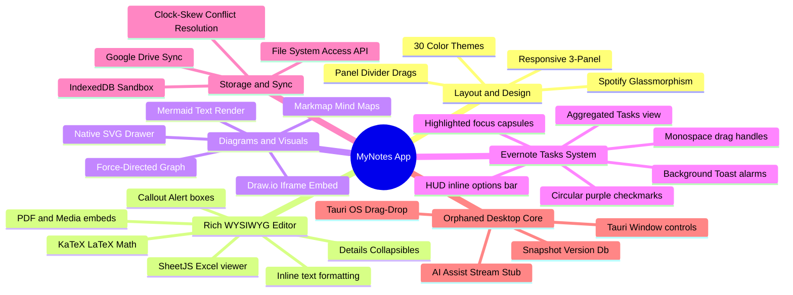
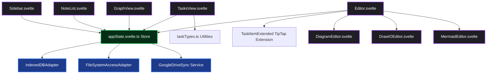
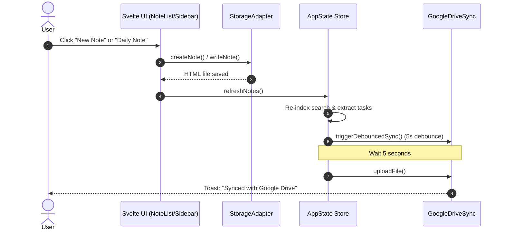
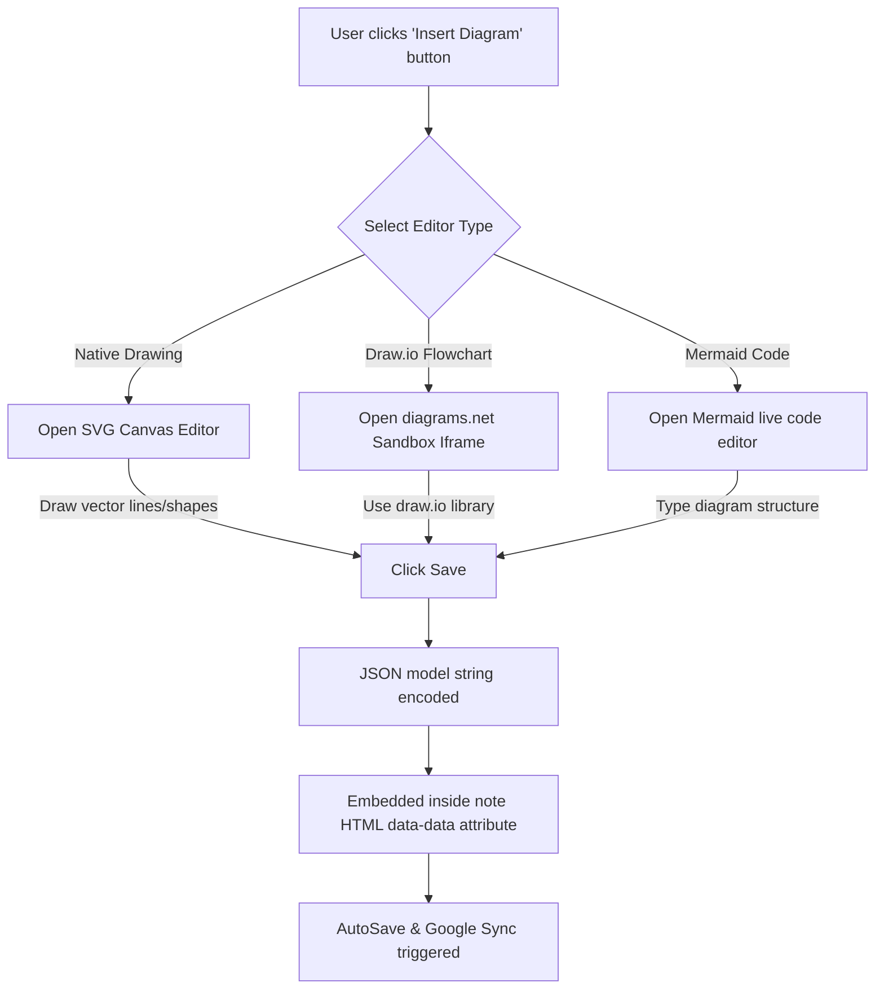
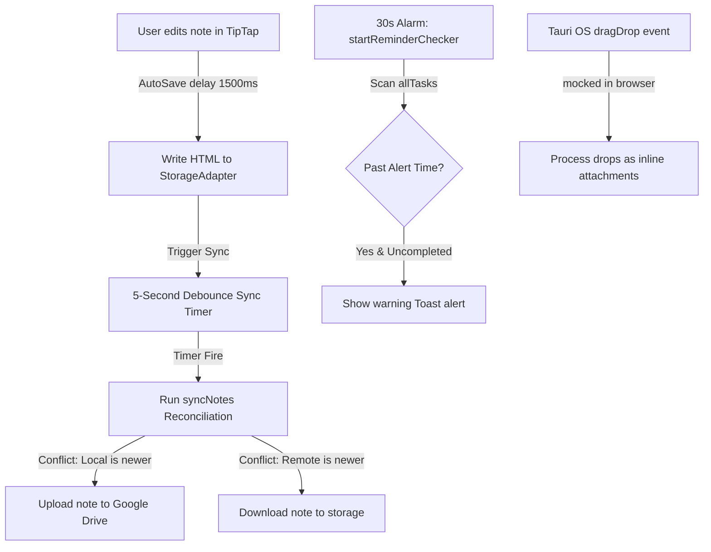
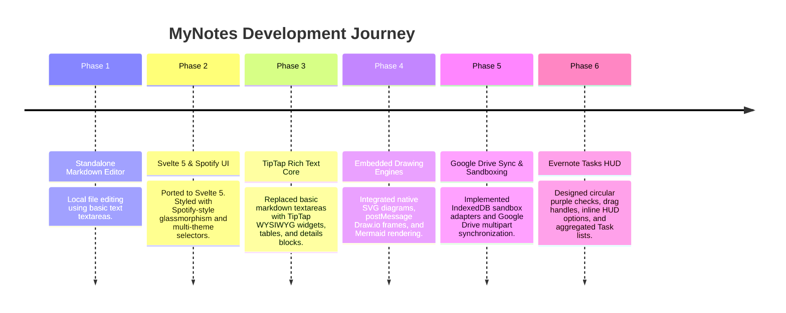

# Product Feature Atlas

This document serves as the definitive feature inventory and architectural atlas for the **MyNotes** application. It reverse-engineers the capabilities of the project, mapping customer-facing features directly to Svelte 5 logic, TipTap rich-text node models, storage adapters, local caches, and the cloud sync layer.

---

## Executive Summary

MyNotes is a premium, local-first, offline-capable note-taking application. Its architecture acts as a browser-first hybrid, combining local sandboxes (IndexedDB) and native file storage (HTML5 File System Access API) with Google Drive cloud backup.

### Feature Portfolio Metrics

| Metric | Count |
| :--- | :--- |
| **Total Features Discovered** | 22 |
| **Completed Features** | 18 |
| **Experimental Features** | 2 (Freehand drawing tool, Draw.io lossless shape conversions) |
| **Hidden / Mocked Features** | 2 (Tauri-based AI Assist, Note Version History snapshots) |
| **Deprecated Features** | 0 (No active deprecations; legacy Markdown file import/parsing was migrated to HTML) |
| **APIs Mapped (Internal & External)** | 12 (Google Drive REST, GIS OAuth, Tauri IPC commands, LocalStorage) |
| **Primary Views/Pages** | 6 (Home Editor, Note List panel, Library index, Search tab, Daily Log, Tasks view) |
| **Core Components** | 11 (AppLayout, NoteList, Sidebar, Editor, TasksView, GraphView, DiagramEditor, DrawIOEditor, MermaidEditor, ResizeHandle, GoogleLogo) |

---

## Product Capability Map



---

## Feature Dependency Graph



---

## Feature Inventory

### 1. Spotify-Inspired Glassmorphic UI & Layout

* **Status:** 🟢 Complete
* **Business Value:** Delivers a premium, dark-themed user experience (UX) modeled after Spotify's aesthetics, featuring smooth glassmorphism (translucent panels, backdrop filters) to establish visual luxury.
* **Technical Implementation:** Uses nested Svelte layouts (`AppLayout.svelte`) supporting draggable panel resizing via visual CSS calculations in `ResizeHandle.svelte`. LocalStorage persists collapsed state and layout dimensions.
* **Entry Points:** Main app mounting and viewport resize listeners.
* **Dependencies:** CSS variables in `app.css`.
* **Related Features:** 30+ Premium Color Themes.
* **Code Locations:** 
  * [AppLayout.svelte](file:///Volumes/SSD%20SN770/piyush/Documents/notes%20app/myNotes/src/lib/components/AppLayout.svelte)
  * [ResizeHandle.svelte](file:///Volumes/SSD%20SN770/piyush/Documents/notes%20app/myNotes/src/lib/components/ResizeHandle.svelte)
* **Confidence Level:** High

---

### 2. Multi-Theme Visual System

* **Status:** 🟢 Complete
* **Business Value:** Increases user personalization and accessibility through 30+ unique color schemes (e.g. Dracula, Cyberpunk, Nordic Frost, Matcha, Sakura).
* **Technical Implementation:** CSS variables mapping colors dynamically. The selected theme class is set on `document.documentElement` (`theme-dracula`, etc.) and persisted in local storage.
* **Entry Points:** Theme picker button inside Sidebar settings overlay.
* **Dependencies:** CSS theme mappings inside `app.css`.
* **Related Features:** Spotify-Inspired Glassmorphic UI.
* **Code Locations:**
  * [app.css](file:///Volumes/SSD%20SN770/piyush/Documents/notes%20app/myNotes/src/app.css)
  * [appState.svelte.ts](file:///Volumes/SSD%20SN770/piyush/Documents/notes%20app/myNotes/src/lib/stores/appState.svelte.ts#L293-L297)
* **Confidence Level:** High

---

### 3. Native File System Access API Adapter

* **Status:** 🟢 Complete
* **Business Value:** Provides native file-system editing without server-side storage, allowing users to select a folder on their computer and modify notes directly as local files.
* **Technical Implementation:** Implements `StorageAdapter` interface using HTML5 `showDirectoryPicker()` to query and request read/write handles, scanning `.html` files recursively.
* **Entry Points:** "Select Folder" button on welcome launch.
* **Dependencies:** Browser support for File System Access API.
* **Related Features:** IndexedDB Sandbox Adapter.
* **Code Locations:**
  * [StorageAdapter.ts](file:///Volumes/SSD%20SN770/piyush/Documents/notes%20app/myNotes/src/lib/storage/StorageAdapter.ts#L209-L387)
* **Confidence Level:** High

---

### 4. IndexedDB Sandbox Adapter

* **Status:** 🟢 Complete
* **Business Value:** Fallback database that allows users to use the app in standard browser contexts (e.g. mobile Safari, Firefox) where local directory file systems are not supported.
* **Technical Implementation:** Concrete `StorageAdapter` implementing IndexedDB databases named `myNotesSandbox` with `notes` and `attachments` object stores.
* **Entry Points:** Automatic fallback trigger when directory picker rejects or is unsupported.
* **Dependencies:** Native browser `indexedDB` object.
* **Related Features:** Native File System Access API Adapter.
* **Code Locations:**
  * [StorageAdapter.ts](file:///Volumes/SSD%20SN770/piyush/Documents/notes%20app/myNotes/src/lib/storage/StorageAdapter.ts#L25-L204)
* **Confidence Level:** High

---

### 5. Google Drive Sync & Conflict Resolution

* **Status:** 🟢 Complete
* **Business Value:** Ensures cross-device availability and reliable cloud backups of notes without locking users into a proprietary database service.
* **Technical Implementation:** Connects via GIS client, requesting drive file permissions, and performing multipart metadata/body uploads. Employs a **Last Modified Wins** algorithm with a 5-minute clock-skew buffer to reconcile differences.
* **Entry Points:** Google login buttons inside settings, debounced save update triggers, and periodic sync intervals.
* **Dependencies:** Google Drive API v3, Google Identity Services SDK.
* **Related Features:** Native File System Access API Adapter.
* **Code Locations:**
  * [GoogleDriveSync.ts](file:///Volumes/SSD%20SN770/piyush/Documents/notes%20app/myNotes/src/lib/sync/GoogleDriveSync.ts)
  * [appState.svelte.ts](file:///Volumes/SSD%20SN770/piyush/Documents/notes%20app/myNotes/src/lib/stores/appState.svelte.ts#L597-L740)
* **Confidence Level:** High

---

### 6. Interactive Note Connection Graph

* **Status:** 🟢 Complete
* **Business Value:** Facilitates personal knowledge base connections (second-brain concept) by displaying notes visually as interconnected neural nodes.
* **Technical Implementation:** Scans note contents via RegExp for double-brackets `[[wikiLink]]` to build edges. Renders a custom 2D Canvas force-directed physics layout with node dragging and panning.
* **Entry Points:** "Graph View" button in editor header bar.
* **Dependencies:** HTML5 Canvas API.
* **Related Features:** Wiki-links Auto-complete.
* **Code Locations:**
  * [GraphView.svelte](file:///Volumes/SSD%20SN770/piyush/Documents/notes%20app/myNotes/src/lib/components/GraphView.svelte)
* **Confidence Level:** High

---

### 7. SheetJS Inline Spreadsheet Viewer

* **Status:** 🟢 Complete
* **Business Value:** Permits users to attach XLS/XLSX/CSV spreadsheet files to their notes and view them inside the editor in a responsive, styled sheet tab format.
* **Technical Implementation:** Intercepts files inside the attachment node renderer. Fetches source array buffers, calls `XLSX.read()` to parse columns and merges, and renders an interactive sheet grid.
* **Entry Points:** Document load or document edit containing spreadsheet attachment node.
* **Dependencies:** `xlsx-js-style` library.
* **Related Features:** File Attachments Renderer.
* **Code Locations:**
  * [Editor.svelte](file:///Volumes/SSD%20SN770/piyush/Documents/notes%20app/myNotes/src/lib/components/Editor.svelte#L1878-L1965)
* **Confidence Level:** High

---

### 8. LaTeX Mathematical Layout Renderer

* **Status:** 🟢 Complete
* **Business Value:** Enables academic, engineering, and scientific users to write professional equations and format math notes directly in standard LaTeX formatting.
* **Technical Implementation:** TipTap extensions parse inline and block math patterns. Translates LaTeX math expressions on-the-fly using the **KaTeX** library.
* **Entry Points:** Editor math commands, inline `$` blocks, and block `$$` equations.
* **Dependencies:** `katex` rendering engine.
* **Related Features:** Rich Text Editor.
* **Code Locations:**
  * Custom MathBlock and MathInline extension loaders in [Editor.svelte](file:///Volumes/SSD%20SN770/piyush/Documents/notes%20app/myNotes/src/lib/components/Editor.svelte#L5138-L5139).
* **Confidence Level:** High

---

### 9. Native SVG Vector Drawing Editor

* **Status:** 🟢 Complete / 🟡 Partial (Freehand pen tool has primitive smoothing)
* **Business Value:** Visual blackboard within notes, allowing users to draw structures, rectangles, circles, lines, arrows, and text.
* **Technical Implementation:** Renders drawing shapes as SVG element objects inside `DiagramEditor.svelte`. Supports click-dragging coordinate mappings, shape selection, resizing handle nodes, and text insertions.
* **Entry Points:** Double-click native diagram placeholder inside editor or click "Insert Diagram" from menu.
* **Dependencies:** SVG manipulation DOM APIs.
* **Related Features:** Draw.io Embedded Editor.
* **Code Locations:**
  * [DiagramEditor.svelte](file:///Volumes/SSD%20SN770/piyush/Documents/notes%20app/myNotes/src/lib/components/DiagramEditor.svelte)
  * [diagram.ts](file:///Volumes/SSD%20SN770/piyush/Documents/notes%20app/myNotes/src/lib/utils/diagram.ts)
* **Confidence Level:** High

---

### 10. Draw.io Iframe Embedded Vector Editor

* **Status:** 🟢 Complete / 🟡 Partial (Draw.io XML translations into native SVG shapes only map standard shapes; complex vectors fallback to lossless XML text strings)
* **Business Value:** Provides enterprise-grade flowchart and mockup editors inside the note editor by bridging diagrams.net capabilities.
* **Technical Implementation:** Embeds a diagrams.net sandbox iframe, communicating via `postMessage`. Converts internal JSON shapes to Draw.io graph XML formats, saving the raw SVG image and editing XML inline.
* **Entry Points:** Diagram insert selector choosing "draw.io" editor type.
* **Dependencies:** diagrams.net online service.
* **Related Features:** Native SVG Vector Drawing Editor.
* **Code Locations:**
  * [DrawIOEditor.svelte](file:///Volumes/SSD%20SN770/piyush/Documents/notes%20app/myNotes/src/lib/components/DrawIOEditor.svelte)
* **Confidence Level:** High

---

### 11. Mermaid.js Flowchart & Diagram Engine

* **Status:** 🟢 Complete
* **Business Value:** Permits text-to-diagram modeling (flowcharts, sequence loops, user journeys) without manually drawing layouts.
* **Technical Implementation:** Creates Svelte wrapper importing `mermaid`. Parses text inputs, runs grammar validation checks, outputs SVG markup, and supports pan/zoom.
* **Entry Points:** Code blocks containing Mermaid syntax.
* **Dependencies:** `mermaid` library.
* **Related Features:** Native SVG Vector Drawing Editor.
* **Code Locations:**
  * [MermaidEditor.svelte](file:///Volumes/SSD%20SN770/piyush/Documents/notes%20app/myNotes/src/lib/components/MermaidEditor.svelte)
* **Confidence Level:** High

---

### 12. Evernote-Style Rich Tasks: In-Editor Widgets

* **Status:** 🟢 Complete
* **Business Value:** Combines text writing and task completion in a single view, formatting to-do list rows into interactive visual widgets matching Evernote's task block layouts.
* **Technical Implementation:** Custom TipTap extension `TaskItemExtended` adds metadata attributes (`data-due-date`, `data-priority`, etc.). CSS formats focused items into shaded capsule rows (`rgba(255,255,255,0.05)`), circle checked purple inputs (`#a855f7`), and hover-activated monospace drag handles (`⋮⋮`).
* **Entry Points:** Creating checklist lines in editor or selecting task nodes.
* **Dependencies:** TipTap task list modules, Svelte 5.
* **Related Features:** Evernote-Style Rich Tasks: HUD Option Bars, Aggregated Tasks view.
* **Code Locations:**
  * [TaskItemExtended.ts](file:///Volumes/SSD%20SN770/piyush/Documents/notes%20app/myNotes/src/lib/extensions/TaskItemExtended.ts)
  * [Editor.svelte](file:///Volumes/SSD%20SN770/piyush/Documents/notes%20app/myNotes/src/lib/components/Editor.svelte#L11348-L11412) (CSS styles)
* **Confidence Level:** High

---

### 13. Evernote-Style Rich Tasks: HUD Option Bars

* **Status:** 🟢 Complete
* **Business Value:** Allows users to easily assign dates, reminders, flags, and options to tasks directly inline.
* **Technical Implementation:** Absolute-positioned floating HUD. On desktop, it aligns directly inside the active task container row on the right-hand side using `nodeDOM` client rects. On mobile, it displays above the row to prevent keyboard overlap.
* **Entry Points:** Cursor focus inside a task line.
* **Dependencies:** DOM coordinate mapping (`editor.view.nodeDOM`).
* **Related Features:** Evernote-Style Rich Tasks: In-Editor Widgets.
* **Code Locations:**
  * [Editor.svelte](file:///Volumes/SSD%20SN770/piyush/Documents/notes%20app/myNotes/src/lib/components/Editor.svelte#L7294-L7390) (Markup)
  * [Editor.svelte](file:///Volumes/SSD%20SN770/piyush/Documents/notes%20app/myNotes/src/lib/components/Editor.svelte#L903-L930) (Position Math)
* **Confidence Level:** High

---

### 14. Centralized Tasks Dashboard

* **Status:** 🟢 Complete
* **Business Value:** Aggregates all checklists and to-dos scattered across multiple notes into a single interface.
* **Technical Implementation:** `refreshTasks()` scans note bodies, extracting metadata tags into an `allTasks` state array. Displays tasks grouped by due categories (Overdue, Today, Upcoming, No Date), with sort (date, priority, note) and hide-completed filters.
* **Entry Points:** "Tasks" tab in Sidebar navigation.
* **Dependencies:** Svelte 5 runes (`$derived.by`).
* **Related Features:** Evernote-Style Rich Tasks.
* **Code Locations:**
  * [TasksView.svelte](file:///Volumes/SSD%20SN770/piyush/Documents/notes%20app/myNotes/src/lib/components/TasksView.svelte)
  * [taskTypes.ts](file:///Volumes/SSD%20SN770/piyush/Documents/notes%20app/myNotes/src/lib/utils/taskTypes.ts)
* **Confidence Level:** High

---

### 15. Background Task Reminders & Toast Alerts

* **Status:** 🟢 Complete
* **Business Value:** Keeps users organized by triggering notifications when task reminder thresholds are reached.
* **Technical Implementation:** Periodic loop running every 30 seconds (`startReminderChecker`) scans task objects for uncompleted items with past reminder timestamps, popping warning toast messages on match.
* **Entry Points:** Application startup.
* **Dependencies:** In-app toast manager.
* **Related Features:** Centralized Tasks Dashboard.
* **Code Locations:**
  * [appState.svelte.ts](file:///Volumes/SSD%20SN770/piyush/Documents/notes%20app/myNotes/src/lib/stores/appState.svelte.ts#L1348-L1383)
* **Confidence Level:** High

---

### 16. Tauri Desktop Window Controls

* **Status:** 🟣 Hidden / Mocked (Active only inside desktop Tauri runtime contexts; stubbed in standalone browser port)
* **Business Value:** Provides standard frameless window controls (minimize, maximize, close) to make the app feel like a native desktop app on macOS and Windows.
* **Technical Implementation:** Hooks into Tauri frame handlers. In browser mode, functions are mock stubs, and header controls are hidden.
* **Entry Points:** Editor/Layout header panels.
* **Dependencies:** `@tauri-apps/api/window` (stubbed in browser).
* **Code Locations:**
  * [Editor.svelte](file:///Volumes/SSD%20SN770/piyush/Documents/notes%20app/myNotes/src/lib/components/Editor.svelte#L178-L184) (Stub adapters)
* **Confidence Level:** High

---

### 17. Tauri AI Assistant Stream

* **Status:** 🟣 Hidden / Mocked (Active inside desktop Tauri runtime contexts; stubbed in browser mode)
* **Business Value:** Increases productivity by translating text, fixing grammar, and summarizing content directly in the editor.
* **Technical Implementation:** Listens for backend `ai-stream` Rust events, appending chunks to Svelte text states. The standalone browser port stubs the backend `aiAsk()` command to a no-op.
* **Entry Points:** Editor highlight context overlays or AI toolbar triggers.
* **Dependencies:** Rust LLM client library (stubbed in browser).
* **Code Locations:**
  * [Editor.svelte](file:///Volumes/SSD%20SN770/piyush/Documents/notes%20app/myNotes/src/lib/components/Editor.svelte#L297) (Stub definition)
  * [Editor.svelte](file:///Volumes/SSD%20SN770/piyush/Documents/notes%20app/myNotes/src/lib/components/Editor.svelte#L6011-L6097) (Stream payload reader)
* **Confidence Level:** High

---

### 18. Note Version Snapshot History

* **Status:** 🟣 Hidden / Mocked (Active inside desktop Tauri runtime; stubbed in browser mode)
* **Business Value:** Protects users against data loss by saving note snapshots before AI changes are applied.
* **Technical Implementation:** Uses Tauri Rust commands to write historical files to a local vault snapshot folder. The standalone browser port stubs `createVersion()` to a no-op.
* **Entry Points:** Applying AI results or clicking save version snapshots.
* **Dependencies:** Tauri file backend APIs.
* **Code Locations:**
  * [Editor.svelte](file:///Volumes/SSD%20SN770/piyush/Documents/notes%20app/myNotes/src/lib/components/Editor.svelte#L294-L296) (Stub definition)
* **Confidence Level:** High

---

## User Journey Maps

### User Journey 1: Creating a Note & Syncing



### User Journey 2: Inserting & Editing a Diagram



### User Journey 3: Creating & Managing Tasks

```mermaid
flowchart TD
  A[User types - [ ] task line in editor] --> B[Presses Enter]
  B --> C[TipTap converts line to taskItem node]
  C --> D[Cursor focuses task node]
  D --> E[HUD Options Bar appears inline on right side]
  
  E --> F{Select Options}
  F -->|Click Today/Tomorrow| G[Attribute data-due-date set]
  F -->|Set Date/Time Reminder| H[Attribute data-reminder set]
  F -->|Toggle Flag| I[Attribute data-flagged set]
  F -->|Click Trash| J[Delete task line node]
  
  G & H & I --> K[Visual indicators updated in editor]
  K --> L[Aggregated in Tasks dashboard]
```

---

## API Surface Analysis

The following table documents the internal IPC boundaries and external web API services used by the application:

| API / Endpoint | Method | Feature | Status |
| :--- | :--- | :--- | :--- |
| `indexedDB` | Native JS | Local sandboxed browser storage | 🟢 Active |
| `showDirectoryPicker` | Native JS | Directory selection for local files | 🟢 Active |
| `google.accounts.oauth2` | GIS JS | Authenticate Drive access | 🟢 Active |
| `https://www.googleapis.com/drive/v3/files` | GET | List remote files and folders | 🟢 Active |
| `https://www.googleapis.com/drive/v3/files` | POST | Create remote folders / files | 🟢 Active |
| `https://www.googleapis.com/upload/drive/v3/files` | POST/PATCH | Multipart media upload | 🟢 Active |
| `https://www.googleapis.com/drive/v3/files/{id}` | GET | Download note HTML | 🟢 Active |
| `https://www.googleapis.com/drive/v3/files/{id}` | DELETE | Delete remote files | 🟢 Active |
| `ai-stream` (Tauri IPC event) | Listen | Stream LLM generation chunks | 🟣 Mocked |
| `aiAsk` (Tauri IPC command) | Call | Invoke local backend LLM prompt | 🟣 Mocked |
| `createVersion` (Tauri IPC) | Call | Save note snapshot to vault | 🟣 Mocked |
| `getNoteVersions` (Tauri IPC) | Call | Fetch note snapshot entries | 🟣 Mocked |

---

## Database Analysis

As a local-first browser app, MyNotes stores database data inside local browser stores and metadata headers rather than traditional server-side SQL engines:

| Entity / Store | Feature | Purpose |
| :--- | :--- | :--- |
| **IndexedDB: `notes`** | Local Storage Sandbox | Key-value store mapping file paths to HTML note models. |
| **IndexedDB: `attachments`** | Attachment Uploads | Flat table mapping attachment names to native file Blobs (PDFs, images, sheets). |
| **LocalStorage: `mynotes_theme`** | Theme Personalization | Stores the active color scheme identifier. |
| **LocalStorage: `mynotes_favorites`** | Favorites Sidebar | Stores an array of note path strings marked as pinned/favorite. |
| **LocalStorage: `mynotes_drive_mappings`** | Sync Reconciliation | Stores a JSON dictionary mapping local file paths to Google Drive file IDs, local sync times, and remote sync times. |
| **HTML Header Metadata** | Document Self-Containment | Stores attributes (`id`, `title`, `tags`, `pinned`, `created`, `modified`) directly in HTML `<meta>` tags inside the note files, ensuring files are fully portable. |

---

## Event-Driven Architecture

The diagram below details the reactive data flows triggered by user inputs, background loops, and stubs:



---

## Infrastructure Feature Mapping

Because MyNotes is a client-side web application and compiled desktop app, its "infrastructure" is composed of client APIs, service workers, and OAuth providers:

* **Service Worker (`sw.js`)**: Powers PWA offline support, caching layout assets, fonts, icons, and handling offline editing.
* **Google Identity Services SDK**: Authenticates user logins and requests Google Drive scope access tokens.
* **HTML5 File System Access API**: Handles direct connection to the local desktop environment, bypasses browser sandboxing restrictions, and reads/writes directories.
* **MiniSearch Engine**: Provides standalone client-side full-text search indexing, handling search indexing entirely within memory.

---

## Hidden Gems

* **Lossless Draw.io Vector Edit**: When inserting flowcharts via Draw.io, the app parses the SVG rendering, but also embeds the raw Draw.io XML inside a hidden attribute `drawioXml` (line 35 of `diagram.ts`). This allows lossless diagram editing even if shape conversions are not 1:1.
* **Tabbed Multi-Sheet Workbook Rendering**: The spreadsheet viewer does not just show the first sheet of an Excel workbook; it renders multiple sheets and adds clickable tabs (`spreadsheet-tabs` in line 1893 of `Editor.svelte`) to let the user switch sheets.
* **Tauri Desktop Remnants**: Stubs for Version snapshots and AI assistant streams are fully integrated in the Svelte code. If this web codebase is dropped into a Tauri workspace containing the corresponding Rust backend handlers, these features will automatically activate.

---

## Technical Debt Opportunities

* **Mock Tauri API Cleanup**: The stubs inside `Editor.svelte` (lines 176–200) are mock adapters. In a clean browser-only web app build, these stubs should be separated into a distinct environment-specific interface layer.
* **Duplicate Frontmatter Parsers**: There are two separate implementations of note frontmatter/HTML metadata parsers: `parseHtmlMetadata` (line 24) and `parseFrontmatter` (line 103) in `appState.svelte.ts`. This duplicate logic should be unified.

---

## Future Feature Candidates

Based on the existing local-first and task-management codebases, the following features could be added with minimal effort:

| Feature Candidate | Estimated Complexity | Reusability Score | Business Value Score |
| :--- | :--- | :--- | :--- |
| **Real Browser AI Assist**: Replace mocked Tauri `aiAsk` with an direct integration calling OpenRouter or Gemini APIs using client keys stored in LocalStorage. | 🟢 Low | 9/10 | 10/10 |
| **Local Git Version Control**: Replace mock version snapshots with an inline history log using `isomorphic-git` to track edits inside IndexedDB. | 🟡 Medium | 8/10 | 9/10 |
| **Task Kanban Board**: Build a Kanban view alongside the Tasks View, grouping task items by priority or status columns. | 🟡 Medium | 9/10 | 8/10 |

---

## Product Evolution Timeline



---

## Final Product DNA

* **What problem does this product solve?**
  MyNotes solves the privacy and fragmentation problem of personal notes. It allows users to own their note files locally (as standard self-contained HTML documents) while retaining the rich styling, math rendering, drawing, and cloud backup conveniences of proprietary apps.
* **What are its core capabilities?**
  Local-first storage, Google Drive sync, LaTeX math layout formatting, vector diagramming, and Evernote-style task management.
* **What are its strongest areas?**
  Its rich, premium UI theme configuration, and its completely self-contained note storage design (embedding all images, drawings, and task metadata directly inside the note HTML files).
* **What is unfinished?**
  The AI Assistant stream, version history snapshots, and local desktop quick-access shortcuts, which are currently stubbed out in this standalone browser version.
* **What should be built next?**
  A direct browser API client connector for Google Gemini, restoring AI Assist functionalities without requiring a Tauri desktop backend.
