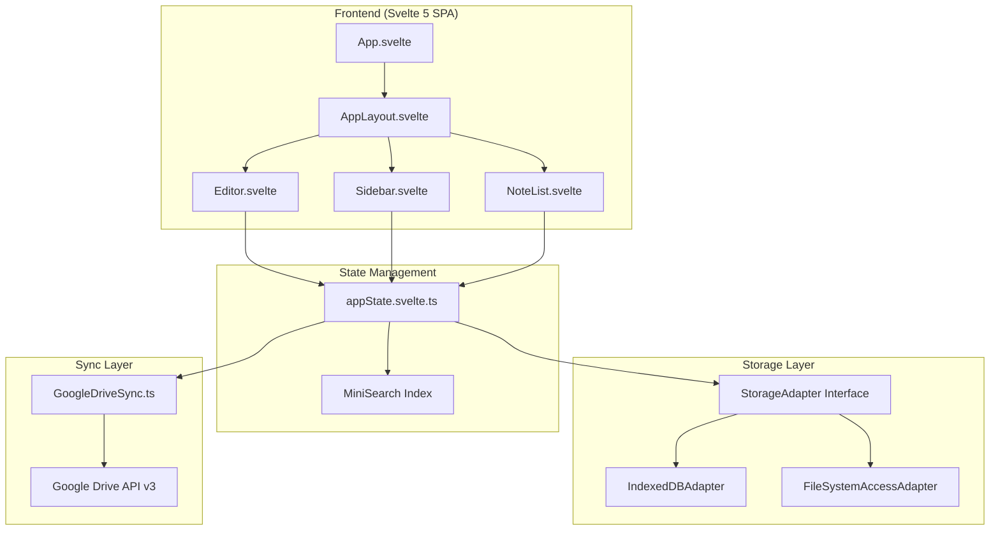
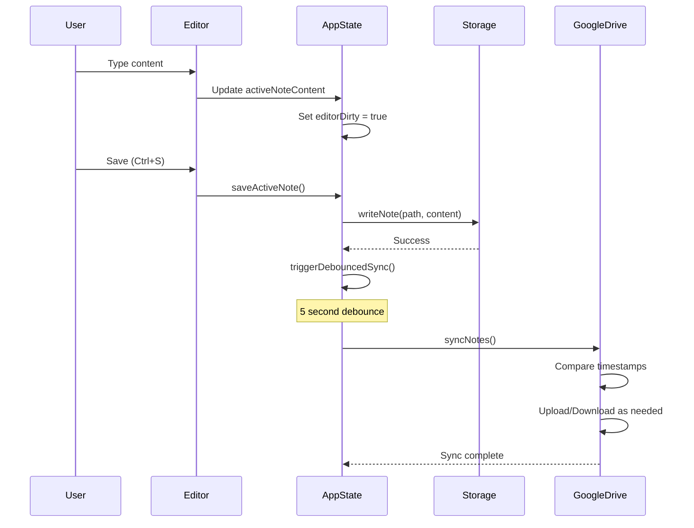
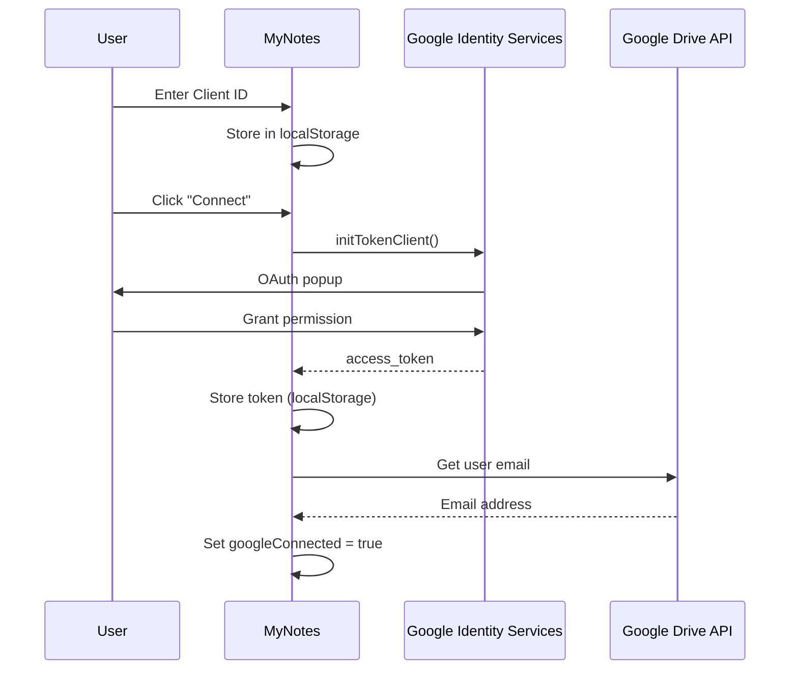
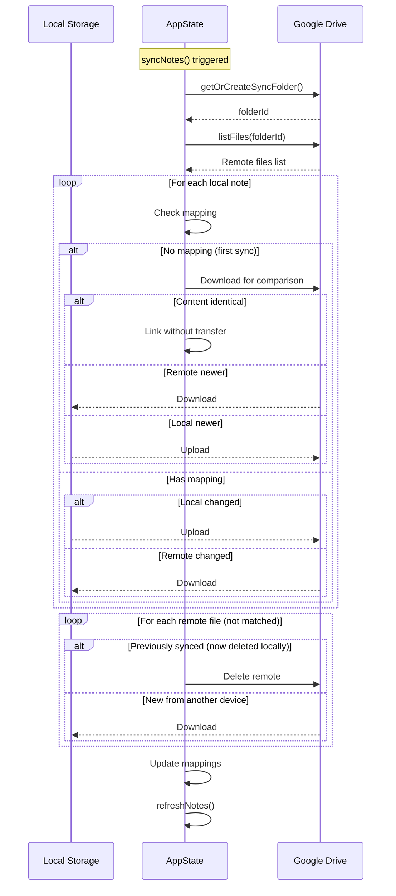
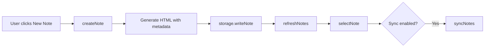
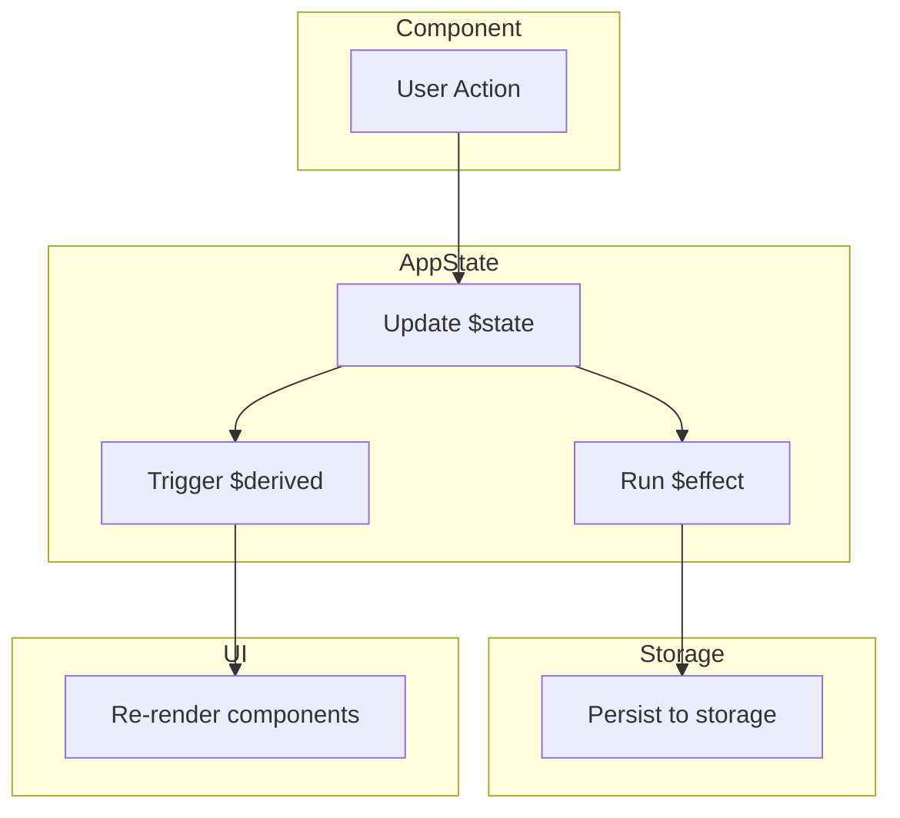

# PROJECT CONTEXT

## Context Metadata

| Field              | Value                          |
| ------------------ | ------------------------------ |
| Project Name       | MyNotes                        |
| Context Version    | 2.2.0                          |
| Last Updated       | 2026-06-16                     |
| Repository Version | 0.0.0                          |
| Framework          | Svelte 5 + TypeScript          |
| Build Tool         | Vite 8.0.12                    |

---

# Executive Summary

## What This Application Does

**MyNotes** is a local-first, privacy-focused notes application that enables users to create, organize, and sync rich-text notes across devices. It combines the power of a full WYSIWYG editor with the simplicity of local storage, offering optional Google Drive synchronization for cross-device access.

## Who Uses It

- **Individual note-takers** who value privacy and offline access
- **Knowledge workers** who need rich formatting (tables, code blocks, math, diagrams)
- **Mobile-first users** who want a responsive PWA experience
- **Power users** who want direct file system access to their notes

## Primary Business Goals

1. Provide a beautiful, distraction-free note-taking experience
2. Ensure data ownership (local-first, user controls their data)
3. Support offline-first workflows with optional cloud sync
4. Deliver cross-platform experience via PWA

## Key Workflows

1. **Note Creation**: Create notes in notebooks with rich formatting
2. **Organization**: Organize with folders (notebooks), tags, and favorites
3. **Editing**: Full WYSIWYG editing with slash commands, tables, diagrams
4. **Sync**: Optional bidirectional Google Drive synchronization
5. **Export**: PDF/HTML export capabilities

---

# Architecture Overview

## High-Level Architecture



## Layer Separation

| Layer | Responsibility | Key Files |
|-------|---------------|-----------|
| **View** | UI rendering, user interaction | All `.svelte` components |
| **State** | Reactive state, business logic | `appState.svelte.ts` |
| **Storage** | Data persistence abstraction | `StorageAdapter.ts` |
| **Sync** | Cloud synchronization | `GoogleDriveSync.ts` |
| **Utils** | Helper functions | `diagram.ts`, `taskTypes.ts`, `debounce.ts` |

## Data Flow



---

# Technology Stack

## Frontend

| Technology | Version | Purpose |
|------------|---------|---------|
| Svelte | 5.55.5 | UI framework with Runes reactivity |
| TypeScript | 6.0.2 | Type safety |
| Vite | 8.0.12 | Build tool, dev server, HMR |

## Rich Text Editor (TipTap)

| Extension | Purpose |
|-----------|---------|
| `@tiptap/starter-kit` | Core formatting (bold, italic, lists, etc.) |
| `@tiptap/extension-table` | Table editing with cell colors |
| `@tiptap/extension-code-block-lowlight` | Syntax-highlighted code |
| `@tiptap/extension-details` | Collapsible sections |
| `@tiptap/extension-image` | Image embeds |
| `@tiptap/extension-link` | Hyperlinks |
| `@tiptap/extension-highlight` | Text highlighting |
| `@tiptap/extension-color` | Text colors |
| `@tiptap/extension-text-align` | Paragraph alignment |
| `@tiptap/extension-typography` | Smart typography |

## Additional Libraries

| Library | Version | Purpose |
|---------|---------|---------|
| KaTeX | 0.16.28 | LaTeX math rendering |
| Mermaid | 11.14.0 | Diagram rendering |
| Markmap | 0.18.12 | Mind map visualization |
| MiniSearch | 7.2.0 | Full-text search |
| lowlight | 3.3.0 | Syntax highlighting |
| lucide-svelte | 1.0.1 | Icon library |
| JSZip | 3.10.1 | File compression |
| jsPDF | 4.2.1 | PDF generation |
| html2canvas | 1.4.1 | HTML to canvas rendering |
| xlsx-js-style | 1.2.0 | Excel export |

## State Management

- **Pattern**: Singleton class with Svelte 5 Runes (`$state`, `$derived`, `$effect`)
- **File**: `appState.svelte.ts` (~1400 lines)
- **Export**: `export const appState = new AppState()`

## Styling

- **Approach**: CSS custom properties (CSS variables)
- **Theme System**: 9+ built-in themes (dark, light, gradient)
- **File**: `app.css` for global styles and themes
- **Component styles**: Scoped `<style>` blocks

## Build System

| Tool | Configuration |
|------|---------------|
| Vite | `vite.config.ts` - base: './' for relative paths |
| TypeScript | `tsconfig.json`, `tsconfig.app.json`, `tsconfig.node.json` |
| Svelte | `svelte.config.js` |

## Testing

- **Current**: No formal test framework implemented
- **Type Checking**: `npm run check` (svelte-check + tsc)

---

# Repository Structure

```
myNotes/
├── src/
│   ├── main.ts                    # App entry point, mounts Svelte app
│   ├── App.svelte                 # Root component, welcome flow
│   ├── app.css                    # Global styles, theme definitions
│   ├── app.d.ts                   # TypeScript declarations
│   ├── assets/                    # Static images (hero.png, logos)
│   └── lib/
│       ├── components/
│       │   ├── AppLayout.svelte   # Main layout (desktop 3-panel, mobile tabs)
│       │   ├── Editor.svelte      # TipTap WYSIWYG editor (~12K lines)
│       │   ├── Sidebar.svelte     # Left navigation panel
│       │   ├── NoteList.svelte    # Middle notes list
│       │   ├── GraphView.svelte   # Note graph visualization
│       │   ├── DiagramEditor.svelte    # Native diagram editor
│       │   ├── DrawIOEditor.svelte     # Draw.io integration
│       │   ├── MermaidEditor.svelte    # Mermaid diagram editor
│       │   ├── ResizeHandle.svelte     # Panel resize handles
│       │   └── GoogleLogo.svelte       # Branding component
│       ├── extensions/
│       ├── stores/
│       │   └── appState.svelte.ts      # Central state management
│       ├── storage/
│       │   └── StorageAdapter.ts       # Storage abstraction layer
│       ├── sync/
│       │   └── GoogleDriveSync.ts      # Google Drive API integration
│       └── utils/
│           ├── debounce.ts             # Debounce utility
│           ├── diagram.ts              # Diagram data model & renderer
├── public/
│   ├── manifest.json              # PWA manifest
│   ├── sw.js                      # Service worker (offline support)
│   ├── favicon.svg                # App icon
│   └── icons.svg                  # Icon sprite
├── index.html                     # HTML entry point
├── vite.config.ts                 # Vite configuration
├── svelte.config.js               # Svelte configuration
├── tsconfig.json                  # TypeScript configuration
├── package.json                   # Dependencies
└── PROJECT_CONTEXT.md             # This file
```

## Key Directories

### `/src/lib/components/`
**Purpose**: All Svelte UI components  
**Ownership**: Frontend team  
**Important Files**:
- `Editor.svelte` - The largest component (~12K lines), handles all rich text editing
- `AppLayout.svelte` - Layout orchestration, responsive design
- `DiagramEditor.svelte`, `DrawIOEditor.svelte`, `MermaidEditor.svelte` - Diagram editing options

### `/src/lib/stores/`
**Purpose**: Application state management  
**Ownership**: Core team  
**Important Files**:
- `appState.svelte.ts` - Single source of truth for all app state

### `/src/lib/storage/`
**Purpose**: Data persistence abstraction  
**Ownership**: Core team  
**Important Files**:
- `StorageAdapter.ts` - Interface + two implementations (IndexedDB, File System Access)

### `/src/lib/sync/`
**Purpose**: Cloud synchronization  
**Ownership**: Core team  
**Important Files**:
- `GoogleDriveSync.ts` - Google Drive API integration

### `/src/lib/utils/`
**Purpose**: Reusable utilities  
**Ownership**: Core team  
**Important Files**:
- `diagram.ts` - Diagram data model, shape rendering, SVG generation
- `taskTypes.ts` - Task data types, date helpers, extraction functions

---

# Feature Catalog

## Feature: Rich Text Editor

### Purpose
Provide full WYSIWYG editing experience with extensive formatting options.

### User Flow
1. User selects or creates a note
2. Editor loads with content
3. User formats text using toolbar or slash commands
4. Auto-save on blur/navigation, manual save with Ctrl+S

### Components
- `Editor.svelte` (main)
- TipTap extensions

### Services
- TipTap/ProseMirror

### Dependencies
- `@tiptap/*` packages
- `lowlight` for syntax highlighting
- `katex` for math rendering

### Status
✅ Complete

### Related Features
- Slash Commands, Tables, Diagrams, Task Lists

---

## Feature: Notebook Organization

### Purpose
Organize notes into folder-based notebooks.

### User Flow
1. User creates a notebook (folder)
2. Notes are created within notebooks
3. Sidebar shows notebook hierarchy
4. Filter notes by selecting a notebook

### Components
- `Sidebar.svelte`
- `NoteList.svelte`

### Services
- `appState.createNotebook()`
- `appState.deleteNotebook()`

### Status
✅ Complete

---

## Feature: Task Management [REMOVED]

### Status
❌ Removed (completely removed from codebase by user request on 2026-06-16).

### Related Features
- Rich Text Editor, Notifications

---

## Feature: Diagram Editor

### Purpose
Create and edit diagrams inline in notes.

### User Flow
1. Insert diagram with `/diagram`
2. Choose editor type (Native, Draw.io, Mermaid)
3. Edit in modal
4. Save to embed in note

### Components
- `DiagramEditor.svelte` - Native shape editor
- `DrawIOEditor.svelte` - Embedded diagrams.net
- `MermaidEditor.svelte` - Mermaid code editor

### Services
- `diagram.ts` utilities

### Status
✅ Complete

---

## Feature: Google Drive Sync

### Purpose
Bidirectional synchronization with Google Drive for cross-device access.

### User Flow
1. User enters Google OAuth Client ID
2. User connects and authorizes
3. Notes sync automatically (debounced 5s)
4. Manual sync available
5. Conflict resolution: Last Modified Wins

### Components
- Settings modal in `AppLayout.svelte`

### Services
- `GoogleDriveSync.ts`
- `appState.syncNotes()`
- `appState.connectGoogleDrive()`

### Dependencies
- Google Identity Services SDK
- Google Drive API v3

### Status
✅ Complete

---

## Feature: Full-Text Search

### Purpose
Search across all notes by title and content.

### User Flow
1. Type in search box
2. Results filter instantly
3. Click result to open note

### Components
- Search input in `Sidebar.svelte` / `AppLayout.svelte`

### Services
- MiniSearch index in `appState`
- `appState.searchQuery`
- `appState.filteredNotes`

### Status
✅ Complete

---

## Feature: Theming System

### Purpose
Customizable visual themes for user preference.

### User Flow
1. Open Settings
2. Select theme from grid
3. Theme applies immediately

### Components
- Theme selector in `AppLayout.svelte`

### Services
- `appState.setTheme()`
- CSS custom properties in `app.css`

### Status
✅ Complete (9+ themes)

---

## Feature: PWA / Offline Support

### Purpose
Installable app with full offline functionality.

### User Flow
1. App works offline via service worker
2. Can install to home screen
3. Data persists in IndexedDB

### Components
- `public/sw.js`
- `public/manifest.json`

### Status
✅ Complete

---

# Google Drive Integration

## Authentication Flow



## APIs Used

| API | Endpoint | Purpose |
|-----|----------|---------|
| Drive v3 | `/drive/v3/files` | List, create, update, delete files |
| Drive v3 | `/drive/v3/about` | Get user info |
| Drive v3 | `/upload/drive/v3/files` | Upload file content |

## Permissions Required

- **Scope**: `https://www.googleapis.com/auth/drive.file`
- **Access**: Only files created by the app
- **No access to**: User's other Drive files

## Folder Structure on Drive

```
Google Drive/
└── MyNotes/                    # Default sync folder
    ├── Note Title.html
    ├── Notebook Folder/
    │   └── Nested Note.html
    └── Daily Notes/
        └── 2026-06-15.html
```

## Sync Flow



## Error Handling

| Error | Handling |
|-------|----------|
| 401 Unauthorized | Clear token, prompt re-auth |
| Network error | Show error toast, retry on next trigger |
| Conflict | Last Modified Wins (with 5-min skew buffer) |

---

# Data Flow Reference

## Note Creation



## Note Content Format

Notes are stored as complete HTML documents:

```html
<!DOCTYPE html>
<html>
<head>
<meta charset="utf-8">
<meta name="id" content="Notebook/Note Title.html">
<meta name="title" content="Note Title">
<meta name="tags" content="tag1,tag2">
<meta name="pinned" content="false">
<meta name="created" content="2026-06-15T10:30:00.000Z">
<meta name="modified" content="2026-06-15T14:45:00.000Z">
<title>Note Title</title>
</head>
<body>
<h1>Note Title</h1>
<p>Note content here...</p>
</body>
</html>
```

## State Update Propagation



---

# UI Component Library

## AppLayout.svelte

### Purpose
Main application layout with responsive desktop/mobile views.

### Inputs
None (uses appState directly)

### Outputs
None

### Key Responsibilities
- Desktop: 3-panel resizable layout
- Mobile: Tab-based navigation with bottom nav
- Settings modal
- Toast notifications

---

## Editor.svelte

### Purpose
Full WYSIWYG rich text editor.

### Inputs
None (uses appState.activeNoteContent)

### Outputs
Updates appState.activeNoteContent, appState.editorDirty

### Key Features
- TipTap integration
- Toolbar with all formatting options
- Slash commands (`/`)
- Math blocks (KaTeX)
- Diagram blocks
- Table editing
- Export functions

---

## Sidebar.svelte

### Purpose
Left navigation panel showing notebooks and favorites.

### Inputs
None (uses appState)

### Outputs
Updates appState.activeNotebook, appState.activeTab

---

## NoteList.svelte

### Purpose
Middle panel showing filtered list of notes.

### Inputs
None (uses appState.filteredNotes)

### Outputs
Calls appState.selectNote()

---


## DiagramEditor.svelte

### Purpose
Native shape-based diagram editor.

### Inputs
- `data: string` - Encoded diagram data
- `onSave: (encoded: string) => void`
- `onCancel: () => void`

### Features
- Shapes: rect, ellipse, diamond, line, arrow, text, freehand
- Color picker, stroke width
- Resize, move, delete shapes

---

# Coding Standards

## Naming Conventions

| Type | Convention | Example |
|------|------------|---------|
| Components | PascalCase | `NoteList.svelte` |
| Files | camelCase for utils, PascalCase for components | `debounce.ts`, `Editor.svelte` |
| Variables | camelCase | `activeNotePath` |
| Constants | UPPER_SNAKE_CASE | `CACHE_NAME` |
| Interfaces | PascalCase | `NoteFile`, `TaskData` |
| Types | PascalCase | `DiagramShapeType` |

## Component Patterns

### Props Pattern (Svelte 5)
```typescript
interface Props {
  data: string;
  onSave: (value: string) => void;
}
let { data, onSave }: Props = $props();
```

### State Pattern
```typescript
let isOpen = $state(false);
let items = $state<Item[]>([]);
```

### Derived Pattern
```typescript
let filtered = $derived(items.filter(i => i.active));
let computed = $derived.by(() => {
  // Complex computation
  return result;
});
```

### Effect Pattern
```typescript
$effect(() => {
  // Side effect on state change
  return () => {
    // Cleanup
  };
});
```

## File Organization

1. Imports at top
2. Interface definitions
3. Component props
4. State declarations
5. Derived values
6. Effects
7. Functions
8. Template markup
9. Scoped styles

## Error Handling Pattern

```typescript
try {
  await riskyOperation();
  appState.showToast('Success!', 'success');
} catch (e) {
  console.error('Operation failed:', e);
  appState.showToast('Operation failed', 'error');
}
```

---

# Architectural Decisions

## ADR-001: Local-First Architecture

**Decision**: Store all data locally by default, with optional cloud sync.

**Reason**: User data ownership and privacy. App must work offline.

**Alternatives Considered**:
- Cloud-first with local cache
- Server-rendered app

**Impact**: Requires robust offline capability, conflict resolution for sync.

---

## ADR-002: Svelte 5 Runes

**Decision**: Use Svelte 5 Runes (`$state`, `$derived`, `$effect`) for reactivity.

**Reason**: Simpler mental model, better TypeScript integration, future-proof.

**Alternatives Considered**:
- Svelte 4 stores
- External state management (Redux-like)

**Impact**: All state management uses Svelte 5 patterns.

---

## ADR-003: HTML Note Format

**Decision**: Store notes as complete HTML documents with metadata in `<meta>` tags.

**Reason**: Rich formatting preservation, portable, can be opened in browsers.

**Alternatives Considered**:
- Markdown with frontmatter
- JSON with HTML content field

**Impact**: Migration from markdown was implemented.

---

## ADR-004: TipTap Editor

**Decision**: Use TipTap (ProseMirror-based) for rich text editing.

**Reason**: Headless, extensible, excellent Svelte integration.

**Alternatives Considered**:
- Slate.js
- Quill
- CodeMirror (for markdown)

**Impact**: Large Editor.svelte component (~12K lines), but full control.

---

## ADR-005: Google Drive Sync Scope

**Decision**: Use `drive.file` scope (app-created files only).

**Reason**: Minimal permissions, users trust the app more.

**Alternatives Considered**:
- Full drive access
- AppData folder only

**Impact**: Can only sync files created by MyNotes, not import existing Drive files.

---

## ADR-006: Dual Storage Adapters

**Decision**: Support both IndexedDB (sandbox) and File System Access API.

**Reason**: Broad browser support (IndexedDB) plus power-user feature (file system).

**Alternatives Considered**:
- IndexedDB only
- Third-party sync service

**Impact**: StorageAdapter interface abstracts differences.

---

## ADR-007: Diagram Editor Options

**Decision**: Offer three diagram editor types: Native, Draw.io, Mermaid.

**Reason**: Different users have different needs. Native is fast, Draw.io is powerful, Mermaid is code-based.

**Alternatives Considered**:
- Single editor type
- Excalidraw integration

**Impact**: Three separate editor components, user preference stored.

---

# Known Limitations

## Technical Debt

1. **Editor.svelte size**: ~12K lines, should be split into smaller modules
2. **No test coverage**: No unit or integration tests
3. **Limited accessibility**: Some ARIA labels missing
4. **Mobile keyboard**: Virtual keyboard handling could be improved

## Constraints

1. **File System Access API**: Only works in Chrome/Edge
2. **Google Drive scope**: Cannot import existing Drive files
3. **Service Worker**: Caches aggressively, may need manual refresh
4. **Large notes**: Performance degrades with very large notes (>100KB)

## Workarounds

1. **Token expiry**: Tokens stored in localStorage, 1-hour expiry, auto-refresh on action
2. **Sync conflicts**: Last Modified Wins with 5-minute skew buffer

## Performance Concerns

1. **Initial load**: Large bundle size due to TipTap/Mermaid dependencies
2. **Search indexing**: Re-indexes all notes on refresh
3. **Diagram rendering**: Complex diagrams may cause lag

---

# Future Work

## Planned Features

- [ ] **Collaborative editing** - Real-time multi-user editing
- [ ] **End-to-end encryption** - Encrypted notes on Drive
- [ ] **Note templates** - Reusable note structures
- [ ] **Backlinks panel** - Show notes linking to current note
- [ ] **Table of contents** - Auto-generated from headings
- [ ] **Voice notes** - Audio recording and transcription

## Partially Implemented

- **PDF export**: Basic implementation, needs formatting improvements
- **Image handling**: Works, but no cloud image sync
- **Mobile responsiveness**: Functional, could use polish

## Improvement Opportunities

1. **Code splitting**: Lazy load Mermaid, KaTeX
2. **Virtualization**: Virtual scroll for large note lists
3. **Offline indicators**: Better UI for sync status
4. **Keyboard navigation**: Full keyboard-only operation
5. **Undo/Redo**: Global undo across app actions

---

# Agent Instructions

Future agents working on this codebase MUST:

## Before Starting Work

1. **Read this PROJECT_CONTEXT.md first** - Do not scan the entire codebase
2. **Understand the architecture** - Follow established patterns
3. **Check ADRs** - Respect previous decisions

## During Development

4. **Follow coding standards** - Use Svelte 5 Runes, naming conventions
5. **Use appState** - All state changes go through appState
6. **Handle errors** - Use try/catch with toast notifications
7. **Consider both layouts** - Desktop and mobile views

## After Changes

8. **Update PROJECT_CONTEXT.md** if:
   - New features added → Update Feature Catalog
   - Architecture changes → Update diagrams
   - New decisions → Add ADR entry
9. **Run type check** - `npm run check`
10. **Increment Context Version** - Update metadata table

## What NOT to Do

- Do NOT bypass appState for direct storage access
- Do NOT add new global state outside appState
- Do NOT use Svelte 4 store patterns
- Do NOT add dependencies without documenting in Technology Stack

---

# Context Update Log

## Version 1.0.0 (June 2025)
- Initial context creation
- Basic project overview
- Technology stack documentation

## Version 2.0.0 (2026-06-15)
- Complete rewrite following new template structure
- Added comprehensive feature catalog
- Added Google Drive integration documentation with sequence diagrams
- Added architectural decision records (ADRs)
- Added detailed component documentation
- Added coding standards and patterns
- Added known limitations and future work
- Added agent instructions
- Documented task management feature
- Documented diagram editor options (Native, Draw.io, Mermaid)
- Updated technology stack with all dependencies

## Version 2.1.0 (2026-06-16)
- Removed Task Management feature entirely from the codebase by user request.
- Deleted `TasksView.svelte`, `TaskItemExtended.ts`, and `taskTypes.ts`.
- Cleaned up Layouts, Sidebar, appState, and Editor to completely eliminate checklists, task HUDs, reminders, and navigation buttons.

## Version 2.1.1 (2026-06-16)
- Configured shadcn Model Context Protocol (MCP) server.
- Added `.vscode/mcp.json` and `.mcp.json` to both `myNotes` and `HelixNotes` project folders.
- Corrected and updated the global `mcp_config.json` symlink pointing to the correct SSD configuration folder.

## Version 2.2.0 (2026-06-16)
- Redesigned mobile editor overlay header in `AppLayout.svelte` (Apple Notes/Keep style with Back, breadcrumbs Notebook title, Done checkmark, and More Actions triggers).
- Implemented slide-up "More Actions" bottom sheet dropdown overlay on mobile to contain all secondary note operations (Favorite, Edit/Read, Source/Rich modes, Focus Mode, Typewriter Scroll, Delete).
- Relocated Note Title input to the top of the scrollable note body in `Editor.svelte` on mobile so it scrolls naturally.
- Redesigned Library tab in `AppLayout.svelte` to use a hierarchical folder-note navigation layout (Grid card notebooks view, Daily Logs folder, and nested files list sub-view).
- Combined preferences and sync modals in `AppLayout.svelte` into a unified tabbed Settings Modal ("Cloud Sync", "Appearance", "Editor & Files") and extended file import / diagram editor configuration to mobile.
- Fixed mobile diagram selection bug where single tap would focus the editor, pop up the virtual keyboard, and cursor would jump to the next line. Added native touch single-tap (toggle actions toolbar) and double-tap (trigger diagram editor) detection directly in Tiptap's Diagram node view.

## Version 2.3.0 (2026-06-21)
- **UI-M-001 (Mobile Information Architecture & Navigation Model):** Introduced a centralized mobile navigation model in `src/lib/stores/mobileNav.svelte.ts` encoding the per-tab navigation hierarchy (tab root → sub-view → editor overlay) with a single consistent `back()` operation that persists unsaved edits before navigating (`flushPendingSave` via `onForceSave`/`saveActiveNote`).
- Integrated the **Android hardware back button** via the new `@capacitor/app` dependency (registered in `App.svelte`); back follows the navigation hierarchy and exits the app only at the Home root. Browser/gesture back continues to be handled by the existing hash-history sync, now guarded against losing unsaved edits.
- Routed all mobile back affordances (editor/notebook/tag) and tab switches through `mobileNav` for consistent behaviour.
- Extracted the mobile bottom navigation into a dedicated `src/lib/components/MobileTabBar.svelte` component (first step of mobile screen/component extraction).
- **New dependency:** `@capacitor/app@8.1.0` (hardware back button). Run `npx cap sync` after install.

## Version 2.4.0 (2026-06-21)
- **UI-M-002 (Bottom Navigation Redesign):** Reworked `MobileTabBar.svelte` — ≥48×48px touch targets, safe-area insets (`env(safe-area-inset-*)`) on all sides, a clearer active-state indicator dot, `touch-action: manipulation`, and reduced-motion support. The bar continues to hide in the full-screen editor.
- **UI-M-003 (Floating Action Button & Quick Create):** Replaced the single-action FAB with a quick-create speed-dial bottom sheet (New Note / Daily Log / New Notebook). The sheet is context-aware (defaults note creation to the active notebook and shows the current notebook context), the FAB rotates to an ✕ when open, and positioning now respects safe-area insets so it never overlaps the bottom nav. All creation flows use the branded `showPrompt`/sheet (no native `prompt()`).
- **UI-M-004 (Mobile Dashboard / Home Redesign):** Added a horizontally-scrolling **Favorites carousel** with CSS scroll-snap, kept Recent Notes as a single-column list, and implemented **pull-to-refresh** on the mobile content area (touch-driven with resistance + spinner) that calls `refreshNotes()` and `syncNotes()` when connected.
- Files: `src/lib/components/MobileTabBar.svelte`, `src/lib/components/AppLayout.svelte`.

## Version 2.5.0 (2026-06-21)
- **UI-M-005 (Mobile Forms & Inputs):** Made the shared `Modal.svelte` keyboard-aware via the visual viewport (adds `padding-bottom` equal to the on-screen keyboard so the dialog and its Submit/Cancel actions are never obscured), and enforced mobile-friendly form controls inside any dialog (16px font to prevent iOS auto-zoom, 44px min targets). Eliminated **all** remaining native `prompt()`/`confirm()`/`alert()` calls app-wide — converted to branded `showToast`/`showConfirmation` across `appState`, `AppLayout`, `Sidebar`, `SettingsModal`, `Editor`, `MermaidEditor`, `DrawIOEditor`, and `DiagramEditor`.
- **UI-M-006 (Mobile Data Presentation):** Note rows across Home/Library/Tags already render as cards (title + notebook badge + modified time). Added a mobile media query so in-note tables size to their content and **scroll horizontally** inside `.tableWrapper` instead of squishing columns. Verified `MetricsBlock` keeps all metrics (Count/Sum/Avg/Min/Max/Median/Income/Expenses/Net) via its responsive `auto-fit` stats grid.
- **UI-M-007 (Touch Interaction Standards):** Added `src/lib/actions/touch.ts` — a canonical `longpress` Svelte action plus shared `LONG_PRESS_MS` (600) / `TOUCH_MOVE_TOLERANCE` (10) constants, now the single source of truth wired into the existing note/tag long-press handlers. Added global touch standards in `app.css`: tap-highlight removal, `touch-action: manipulation`, a `.touch-target` (≥44px) utility, minimum hit areas for compact icon controls on coarse pointers, and motion-free `:active` press feedback (transform-based feedback remains disabled under the existing `prefers-reduced-motion` reset).

## Version 2.6.0 (2026-06-21)
- **Shared primitive — `BottomSheet.svelte`:** New reusable bottom-sheet with drag-to-dismiss (grabber drag past threshold), backdrop tap-to-close, safe-area padding, and back-button integration. `mobileNav` gained an **overlay stack** (`registerOverlay`/`hasOverlay`) so `back()` dismisses the topmost open sheet/modal before navigating.
- **UI-M-010 (Filters & Bottom Sheets):** Migrated the Quick-Create, Tag-Actions, and Tag Color-Picker sheets to the shared `BottomSheet`. Removed the old ad-hoc `.color-picker-backdrop`/`.quick-create-sheet` markup + CSS.
- **UI-M-011 (Modals & Drawers):** `Modal.svelte` and `BottomSheet.svelte` now register with the `mobileNav` overlay stack, so the Android hardware back button and the edge-swipe-back gesture close confirmations, prompts, move/copy, and sheets first. The editor mobile "More Actions" menu is also registered.
- **UI-M-009 (Mobile Search):** New full-screen `MobileSearch.svelte` — autofocus search, recent queries (localStorage), scope chips (All Notes + per-notebook), large result rows with notebook badge and highlighted content snippets. Entry point added to the Home header search icon; integrates with the back-button overlay stack.
- **UI-M-008 (Gestures):** Added `swipeActions` and `edgeSwipeBack` actions to `touch.ts`. Note rows now support horizontal swipe (right → toggle Favorite with toast; left → Delete with branded confirmation as the undo safety) with live translate feedback, integrated into the shared note-touch handlers. Edge-swipe-from-left on the tab content triggers `mobileNav.back()`. Pinch/pan already exists in the Mermaid editor; native diagram/graph views retain pointer pan/zoom.
- Files: `src/lib/components/BottomSheet.svelte`, `src/lib/components/MobileSearch.svelte`, `src/lib/actions/touch.ts`, `src/lib/stores/mobileNav.svelte.ts`, `src/lib/components/Modal.svelte`, `src/lib/components/AppLayout.svelte`.

---

*This document is the authoritative project memory. Keep it updated.*

